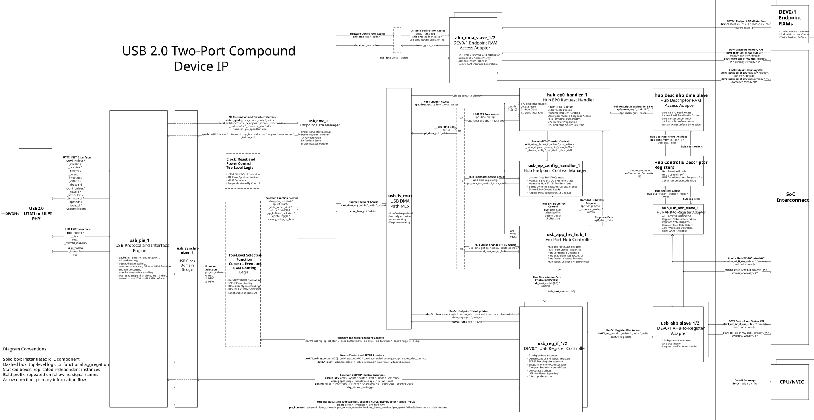

## Architecture Overview

The IP implements a USB 2.0 compound device composed of:

- one embedded two-port USB Hub;
- two software-controlled downstream USB devices, DEV0 and DEV1;
- one shared USB Protocol and Interface Engine;
- one shared endpoint data manager;
- independent control interfaces and Endpoint RAMs for DEV0 and DEV1.

The embedded Hub is assigned function index `0`, DEV0 is assigned index `1`,
and DEV1 is assigned index `2`.

The shared USB Protocol and Interface Engine receives the enable state,
current address, and temporary address of all three functions. For each USB
transaction, the protocol engine performs function address matching and
generates the selected-function index.

The selected-function index controls:

- Hub versus software-device access selection;
- DEV0 versus DEV1 Endpoint RAM selection;
- endpoint-context selection;
- SETUP-event routing;
- DMA endpoint-state update routing;
- grant and read-data response selection.

The embedded Hub uses a register-based endpoint implementation. Its EP0 and
EP1 IN runtime contexts are maintained by dedicated hardware, while
descriptors and the SETUP request decode table are stored in an external Hub
Descriptor RAM.

DEV0 and DEV1 use independent Endpoint RAMs containing their Endpoint Lists,
endpoint contexts, and TX/RX payload buffers. Each RAM can be accessed both
by the internal USB data path and by an external AHB master.

The USB protocol logic operates in the `pie_clk` domain. Endpoint processing,
register interfaces, Hub control, DMA operation, and AHB access operate in
the `hclk` domain. A dedicated clock-domain bridge transfers control, status,
event, context, and payload information between the two domains.

## Detailed Architecture

The following diagram provides a detailed view of the USB compound device architecture, including its functional partitioning, internal connectivity, and main interfaces.



The following sections describe the role, connectivity, and operational behavior of each block shown in the diagram.

---

## Main RTL Blocks

### USB 2.0 UTMI or ULPI PHY

The external PHY implements the electrical and low-level signaling interface
to the USB bus.

The IP supports UTMI and ULPI interface alternatives. The selected PHY clock
is used to generate `pie_clk`, while the active PHY interface exchanges
packet data, line state, transmit control, receive status, and low-power
signaling with the shared USB Protocol and Interface Engine.

The PHY boundary is external to the compound-device IP.

---

### `usb_pie_1` - USB Protocol and Interface Engine

**Entity:** `usb_pie`  
**Source:** `RTL/usb_pie.m.vhdl`  
**Clock domain:** `pie_clk`

`usb_pie_1` is the shared USB protocol engine used by the embedded Hub, DEV0,
and DEV1.

The PIE performs:

- UTMI and ULPI interface control;
- USB packet transmission and reception;
- token and packet-type decoding;
- USB address matching;
- Hub, DEV0, or DEV1 function selection;
- endpoint number and direction decoding;
- endpoint-context request generation;
- TX and RX payload exchange;
- USB handshake generation;
- transfer completion and result reporting;
- USB reset, suspend, resume, and LPM handling;
- Full-Speed and High-Speed protocol handling;
- USB frame and microframe timing.

The PIE receives an aggregated function-selection context containing the
effective enable, current address, and temporary address of each USB
function. When a token is accepted, the PIE generates `pie_dev_selected` to
identify the target function.

The PIE does not know whether the selected endpoint context is implemented
in registers or RAM. It uses a common endpoint-information interface and
relies on the downstream routing and endpoint data path to obtain context and
payload information.

For a received SETUP transaction, the PIE:

1. selects the addressed USB function;
2. requests the associated EP0 context;
3. identifies the transaction as SETUP;
4. transfers the eight-byte SETUP payload to the endpoint data manager;
5. generates a SETUP-received event once the packet has been accepted.

---

### `usb_synchronizer_1` - USB Clock-Domain Bridge

**Entity:** `usb_synchronizer`  
**Source:** `RTL/usb_synchronizer.m.vhdl`  
**Clock domains:** `pie_clk` and `hclk`

`usb_synchronizer_1` is the central clock-domain bridge between the USB
protocol domain and the system-side endpoint-processing domain.

The bridge transfers:

- endpoint-context requests;
- endpoint number, direction, and SETUP indication;
- selected-function index;
- SETUP-received events;
- endpoint context and runtime state;
- TX and RX payload data;
- transfer-completion and result events;
- bus reset, suspend, LPM, speed, and frame information;
- USB/PHY control and PHY register-access information.

The implementation uses synchronization methods appropriate to the type of
information being transferred, including status synchronization, event
transfer, and event-qualified data transfer.

Architecturally, the block establishes the boundary between:

- USB packet and link processing in the `pie_clk` domain;
- endpoint context, payload, register, and Hub processing in the `hclk`
  domain.

---

### `usb_dma_1` - Endpoint Data Manager

**Entity:** `usb_dma`  
**Source:** `RTL/usb_dma.m.vhdl`  
**Clock domain:** `hclk`

`usb_dma_1` is the shared endpoint context and payload-transfer engine for
the Hub, DEV0, and DEV1.

For each request generated by the PIE, the endpoint data manager first
retrieves the context of the selected endpoint. The returned context allows
the PIE to determine whether the endpoint is active, disabled, stalled, or
ready to transfer data, as well as the current toggle, available byte count,
maximum packet information, and endpoint type.

After the context lookup, the endpoint data manager performs the required
payload operation:

- TX payload fetch for an IN transaction;
- RX payload store for an OUT transaction;
- eight-byte SETUP payload transfer for a SETUP transaction;
- endpoint runtime-state update after transfer completion.

For a SETUP transaction, the endpoint data manager applies special behavior,
including:

- forcing an eight-byte transfer size;
- selecting the SETUP buffer entry;
- treating the transfer differently from a normal EP0 OUT transaction.

For DEV0 and DEV1, the endpoint data manager accesses the selected Endpoint
RAM. For the Hub, the endpoint data manager accesses dedicated hardware
resources through the Hub function path.

The endpoint data manager also updates endpoint state after a transfer,
including active state, byte count, toggle-related state, interrupt state,
buffer selection, and skip state.

---

### `usb_fs_mux_1` - USB DMA Path Mux

**Entity:** `usb_fs_mux`  
**Source:** `RTL/usb_fs_mux.m.vhdl`  
**Implementation:** combinational

`usb_fs_mux_1` routes each shared endpoint access generated by `usb_dma_1`
toward one of two mutually exclusive paths:

- the embedded Hub function path;
- the DEV0/DEV1 Endpoint RAM path.

The path is selected using `dma_ahb_selected`, which is derived from the
function selected by the PIE:

- Hub selected: route the access to `upd_dma_*`;
- DEV0 or DEV1 selected: route the access to `ahb_dma_*`.

The block distributes address, write control, and write data to both paths,
but asserts the request only on the selected path. Grant and read data from
the selected path are multiplexed back to `usb_dma_1`.

The block contains no registers, FSM, or arbitration policy.

---

### Selected-Function Context, Event, and RAM Routing

**Implementation:** top-level combinational and sequential logic  
**Clock domain:** primarily `hclk`

This top-level logic uses `sync_pie_dev_selected` to select and route the
state associated with the function currently being serviced.

The function-index mapping is:

```text
0: Embedded Hub
1: DEV0
2: DEV1
```

The logic selects the function context presented to `usb_dma_1`, including:

- Endpoint List base;
- data-buffer base;
- endpoint skip state;
- current buffer selection;
- endpoint toggle state;
- software SETUP-pending state.

For DEV0 and DEV1, these values are selected from the corresponding
`usb_reg_if` instance.

For the Hub, the logic supplies predefined address-mapping values that allow
the endpoint data manager to access the dedicated hardware regions:

```text
00: Hub EP0 data and response path
01: Hub Status Change EP1 IN payload
10: Unimplemented
11: Hub endpoint context
```

The same selected-function index also controls:

- Hub versus software-device DMA-path selection;
- DEV0 versus DEV1 Endpoint RAM selection;
- SETUP-event destination;
- DMA endpoint-state update destination;
- grant and read-data response selection.

This logic provides the central connection between the function selected by
the PIE and the physical register or memory resources that implement the
selected endpoint.

---

## Embedded Hub Subsystem

### `hub_ep0_handler_1` - Hub EP0 Request Handler

**Entity:** `usb_ep0_handler`  
**Source:** `RTL/usb_ep0_handler.m.vhdl`  
**Clock domain:** `hclk`

`hub_ep0_handler_1` implements the control-endpoint processing for the
embedded Hub function. It does not process EP0 transactions for DEV0 or DEV1.

The eight-byte SETUP packet received through the endpoint data manager is
stored internally in `setup_bytes[63:0]`.

After the Hub SETUP-decode trigger is received, the handler:

1. reads the Hub device-link entry from the Hub Descriptor RAM;
2. locates the associated SETUP decode table;
3. compares the stored SETUP packet against table patterns and masks;
4. obtains the internal request code and response-buffer selection;
5. prepares the context for the subsequent EP0 DATA or STATUS stage.

The handler directly processes supported USB standard requests, including:

- `SET_ADDRESS`;
- `SET_CONFIGURATION`;
- `GET_CONFIGURATION`;
- `GET_INTERFACE`;
- Device, Interface, and Endpoint `GET_STATUS`;
- Device and Endpoint `SET_FEATURE`;
- Device and Endpoint `CLEAR_FEATURE`.

Short standard-request responses are generated internally from current
device or endpoint state and protocol-defined constant fields. The generated
response is stored as a snapshot when SETUP decoding completes.

Longer stored responses, particularly USB descriptors, are read from the Hub
Descriptor RAM.

Requests belonging to the USB Hub Class are dispatched to
`usb_app_hw_hub_1` using the decoded request code, `wValue`, and `wIndex`.

The handler also selects the source of EP0 response data:

```text
Standard-request response
Hub Class response
Descriptor or stored response data
```

During SETUP-table decoding, the handler actively controls the Hub Descriptor
RAM interface. During a subsequent EP0 IN data stage, the endpoint data
manager initiates the read and the handler acts as the EP0 response gateway
and response-source multiplexer.

---

### `usb_ep_config_handler_1` - Hub Endpoint Context Manager

**Entity:** `usb_ep_config_handler`  
**Source:** `RTL/usb_ep_config_handler.m.vhdl`  
**Clock domain:** `hclk`

`usb_ep_config_handler_1` maintains the runtime context of the register-based
Hub endpoints:

- Hub EP0 OUT;
- Hub EP0 IN;
- Hub Status Change EP1 IN.

After the EP0 handler completes SETUP decoding, the context manager captures:

- EP0 IN and OUT active state;
- transfer direction;
- transfer byte count;
- response or data-buffer selection.

For Hub EP1 IN, the context manager receives buffer availability, clear,
size, and stall information from the Hub controller.

The block stores current endpoint runtime information, including:

- active state;
- disabled state;
- stall state;
- byte count;
- buffer state;
- toggle-reset-related state.

The stored information is formatted into the common endpoint-context
representation expected by `usb_dma_1`.

When the endpoint data manager reads Hub address region `11`, the block
returns the addressed endpoint-context entry. The endpoint data manager then
decodes that entry into the individual `epinfo_*` signals returned to the
PIE.

The same interface supports writes from `usb_dma_1`, allowing the endpoint
data manager to update the Hub endpoint state as a transfer progresses.

Architecturally, this block adapts the register-based Hub endpoint
implementation to the same endpoint-context model used by the RAM-based
software devices.

---

### `usb_app_hw_hub_1` - Two-Port Hub Controller

**Entity:** `usb_app_hw_hub`  
**Source:** `RTL/usb_app_hw_hub.m.vhdl`  
**Clock domain:** `hclk`  
**Configuration:** two downstream ports

`usb_app_hw_hub_1` implements the USB Hub Class behavior and the operational
control of the two downstream ports.

The port mapping is:

```text
Hub Port 1: DEV0
Hub Port 2: DEV1
```

For Hub Class requests received through EP0, the controller:

- interprets Hub and Port class requests;
- selects the target port using `wIndex`;
- reads or updates Hub and port state;
- generates Hub or Port status response data;
- applies port feature set and clear operations;
- generates downstream port-reset pulses.

The controller receives the downstream soft-connect indication of each
software device. It maintains independent state for each port, including:

- connection status;
- connection-change indication;
- enable state;
- reset-change indication.

A port reset generates a pulse toward the corresponding software-device
reset path and places the port in the enabled state.

The controller also implements the Hub Status Change Interrupt endpoint,
Hub EP1 IN. When a port status-change condition is pending, the controller:

- marks the EP1 IN report as available;
- communicates EP1 IN context updates to the Hub Endpoint Context Manager;
- generates the status-change bitmap returned to the endpoint data manager.

The controller therefore has two independent USB data roles:

- generation of Hub Class response data for EP0 IN;
- direct generation of the Hub Status Change payload for EP1 IN.

---

### Hub Function Resource Decoder and Response Mux

**Implementation:** top-level combinational logic

The Hub function access path is divided into address regions using
`upd_dma_addr[16:15]`:

```text
00: Hub EP0 data and response access
01: Hub Status Change EP1 IN payload access
10: Unimplemented
11: Hub endpoint context access
```

The logic demultiplexes the request toward:

- `hub_ep0_handler_1`;
- `usb_app_hw_hub_1`;
- `usb_ep_config_handler_1`.

Address, write control, and write data remain common where required. Only the
appropriate regional request is asserted.

Grant and read-data responses from the three implemented destinations are
multiplexed back onto the common `upd_dma_*` response path.

The decoder contains no state or arbitration.

---

### `hub_desc_ahb_dma_slave` - Hub Descriptor RAM Access Adapter

**Entity:** `ahb_dma_slave`  
**Source:** `RTL/ahb_dma_slave.m.vhdl`  
**Clock domain:** `hclk`

`hub_desc_ahb_dma_slave` connects the Hub Descriptor RAM to two requesters:

- the internal read-only request generated by the Hub EP0 handler;
- the external Hub Descriptor RAM AHB interface.

The internal Hub EP0 requester has priority over an external AHB request.
When an internal read is active, an external AHB access can be delayed using
the AHB ready response.

The adapter performs:

- internal-request and external-AHB arbitration;
- AHB wait-state generation;
- byte-address to native RAM-address conversion;
- write-data alignment;
- write-selection mask generation;
- read-data selection;
- native RAM control generation.

The internal EP0 path is read-only. External AHB accesses can read and write
the Hub Descriptor RAM.

---

### Hub Descriptor RAM

The external Hub Descriptor RAM stores the data required by the hardware Hub
EP0 implementation.

Its contents include:

- USB descriptors and other stored EP0 response data;
- the Hub SETUP request decode table;
- request comparison patterns and masks;
- internal request identifiers;
- response and data-buffer references.

The RAM does not store the runtime endpoint context of Hub EP0 or Hub EP1 IN.
That state is maintained by `usb_ep_config_handler_1`.

The eight-byte SETUP packet received from the USB bus is also not stored in
this RAM. It is stored in internal registers within `hub_ep0_handler_1`.

---

## Software-Device Control Subsystems

### `usb_reg_if_1/2` - DEV0/DEV1 USB Register Controllers

**Entity:** `usb_reg_if`  
**Source:** `RTL/usb_reg_if.m.vhdl`  
**Clock domain:** `hclk`

`usb_reg_if_1` and `usb_reg_if_2` implement independent software-visible
control and status registers for DEV0 and DEV1.

Each instance maintains:

- current and temporary USB address;
- local function-enable state;
- downstream soft-connect state;
- hardware-set, software-cleared SETUP-pending state;
- Endpoint List base address;
- data-buffer base address;
- endpoint skip state;
- current buffer selection;
- endpoint data-toggle state;
- device, endpoint, frame, error, and bus-event status;
- interrupt status, enable, and routing;
- independent IRQ and FIQ outputs.

When a SETUP packet is received for the selected software device, the
corresponding register controller:

- sets its SETUP-pending state;
- captures the USB address used for the transaction;
- initializes the temporary address to the same value;
- initializes the EP0 IN and OUT toggle state.

The SETUP-pending state remains asserted until cleared by software. While the
flag is set, `usb_dma_1` reports EP0 as inactive and not stalled, causing the
PIE to return NAK to subsequent EP0 transactions. This allows software time
to read and decode the SETUP packet, configure the response buffer, and
prepare the next control-transfer stage.

The current and temporary addresses are supplied to the PIE for function
address matching. During `SET_ADDRESS`, the temporary address can differ from
the current address so that the protocol engine can support the address
transition.

The register controllers do not contain the complete endpoint context. They
maintain compact endpoint-control state, while the detailed endpoint entries
and payload data reside in the corresponding Endpoint RAM.

`usb_reg_if_1`, associated with DEV0, additionally owns the common USB link,
PHY, LPM, test, wake-up, and VBUS control outputs used by the shared PIE and
the top-level integration logic.

The corresponding outputs exist formally in `usb_reg_if_2`, because the same
entity is instantiated, but the outputs are not connected in the current
top-level implementation.

---

### `usb_ahb_slave_1/2` - DEV0/DEV1 AHB-to-Register Adapters

**Entity:** `usb_ahb_slave`  
**Source:** `RTL/usb_ahb_slave.m.vhdl`  
**Clock domain:** `hclk`

`usb_ahb_slave_1` and `usb_ahb_slave_2` convert the external DEV0 and DEV1
control AHB interfaces into the internal register-file interface used by the
corresponding `usb_reg_if` instance.

Each adapter performs:

- AHB transfer qualification;
- register read-address generation;
- register write-address generation;
- register write dispatch;
- register read-data return;
- fixed AHB `OKAY` response generation.

The register path operates without inserted wait states.

These adapters provide access only to the software-visible USB control
registers. Endpoint RAM access is provided through separate AHB interfaces
and separate RAM access adapters.

---

### `ahb_dma_slave_1/2` - DEV0/DEV1 Endpoint RAM Access Adapters

**Entity:** `ahb_dma_slave`  
**Source:** `RTL/ahb_dma_slave.m.vhdl`  
**Clock domain:** `hclk`

`ahb_dma_slave_1` and `ahb_dma_slave_2` connect the DEV0 and DEV1 Endpoint
RAMs to:

- the internal shared endpoint data manager;
- the corresponding external Endpoint RAM AHB interface.

The adapters arbitrate between internal USB access and external AHB access.
Internal USB requests have priority. An external AHB transaction is delayed
when the RAM is being used by the internal endpoint data path.

Each adapter performs:

- internal USB DMA and external AHB arbitration;
- AHB wait-state generation;
- byte-address to native RAM-address conversion;
- write-data alignment;
- DWORD and byte-lane selection;
- native RAM chip-select and write-enable generation;
- read-data return.

The selected-function routing logic asserts only one of the DEV0 or DEV1
internal RAM requests. Address, write control, and write data can be
distributed to both adapters, while the request signal determines the active
target. Grant and read data are selected from the active adapter and returned
to `usb_dma_1`.

---

### DEV0/DEV1 Endpoint RAMs

DEV0 and DEV1 use two independent external Endpoint RAM instances.

Each RAM stores:

- the Endpoint List;
- detailed endpoint transfer contexts;
- endpoint buffer addresses and transfer parameters;
- TX payload buffers;
- RX payload buffers.

The internal endpoint data manager reads endpoint context and TX data from
the selected RAM and writes received RX data and endpoint-state updates back
to that RAM.

The external AHB interfaces allow the system to:

- initialize EP0 and the other endpoint entries;
- configure endpoint type, active state, packet size, and buffer location;
- write TX payload data;
- read received RX payload data;
- inspect endpoint state during debug.

---

## Hub Control Subsystem

### `hub_usb_ahb_slave_1` - Hub AHB-to-Register Adapter

**Entity:** `usb_ahb_slave`  
**Source:** `RTL/usb_ahb_slave.m.vhdl`  
**Clock domain:** `hclk`

`hub_usb_ahb_slave_1` converts the external Hub Control AHB interface into
the internal `hub_reg_*` register-access interface.

The adapter provides:

- AHB transfer qualification;
- register address generation;
- register write dispatch;
- register read-data return;
- zero-wait-state operation;
- fixed AHB `OKAY` response generation.

The adapter does not contain the Hub control register itself. The register is
implemented by top-level sequential and combinational logic.

---

### Hub Control Register

**Implementation:** top-level logic  
**Clock domain:** `hclk`

The Hub Control Register contains two software-controlled fields:

```text
Hub Function Enable
Hub Upstream Soft Connect
```

The register is accessed through `hub_usb_ahb_slave_1` and the internal
`hub_reg_*` interface.

The effective Hub-mode enable is generated from the software Hub-enable bit
and the synchronized external `USB_EnableHub` input.

The effective Hub upstream connection is qualified by the debounced VBUS
state.

The resulting Hub control state is used to:

- enable the Hub function context presented to the PIE;
- select the Hub upstream connect path;
- enable Hub-mode qualification of DEV0 and DEV1;
- select Hub port-reset routing;
- select Hub or non-Hub operating behavior.

Architecturally, the register and the associated connection logic form the
Hub equivalent of the local enable and soft-connect controls present in the
DEV0 and DEV1 register controllers.

---

## Clock, Reset, and Power-Control Logic

**Implementation:** top-level logic  
**Clock domains:** `hclk`, UTMI/ULPI clocks, and `pie_clk`

The Clock, Reset, and Power-Control logic manages the integration of the USB
protocol and system clock domains.

Its responsibilities include:

- UTMI or ULPI clock selection for `pie_clk`;
- asynchronous reset assertion and synchronized PIE reset release;
- UTMI reset and suspend control;
- VBUS debounce;
- low-power and clock-stop handling;
- USB clock-request generation;
- suspend, resume, and wake-up coordination.

The logic receives system reset, UTMI and ULPI clock/status information, VBUS
state, PIE low-power state, and system wake-up control.

It provides:

- `pie_clk` and the synchronized PIE reset;
- debounced VBUS status;
- UTMI reset and suspend controls;
- USB clock and wake-up requests toward the SoC.

The USB bus reset detected by the PIE is separately transferred into the
`hclk` domain by `usb_synchronizer_1`. The synchronized bus-reset event
realigns the Hub and software-device architectural state, including USB
addresses, endpoint contexts, control-transfer state, and software-visible
status.

---

## Architectural Notes

- The PIE selects one USB function for each accepted transaction.
- Hub, DEV0, and DEV1 share the PIE, synchronizer, and endpoint data manager.
- The Hub uses register-based endpoint context and hardware-generated
  responses.
- DEV0 and DEV1 use independent RAM-based endpoint contexts and payload
  buffers.
- The Hub EP0 handler processes only the embedded Hub control endpoint.
- Hub EP1 IN is implemented directly by the Hub controller and does not use a
  dedicated payload RAM.
- DEV0 owns the common USB/PHY control outputs used by the shared
  architecture.
- Function selection, context selection, SETUP routing, Endpoint RAM
  selection, and DMA update routing are implemented in top-level logic.
- Internal USB accesses have priority over external AHB accesses to the three
  external RAMs.
- The architecture diagram intentionally represents some top-level signal
  paths as functional connections rather than reproducing every intermediate
  RTL net.

---

## Functional Interfaces

This section describes the main functional interfaces shown in the
architecture diagram.

The interfaces are presented following the main operating flow:

```text
PIE
  -> Clock-Domain Bridge
  -> Endpoint Data Manager
  -> Hub or software-device path
  -> Endpoint context, response logic, or Endpoint RAM
```

Signal names follow the convention used in the diagram: when a prefix is
shown once in bold, the following names beginning with an underscore inherit
the same prefix.

Some connections are represented functionally rather than reproducing every
intermediate top-level net. These simplifications are identified explicitly
where relevant.

---

### USB Function Selection Context

**Direction:** Top-level function-context logic to `usb_pie_1`

This interface provides the PIE with the enable and address state of the
three USB functions.

```text
usbreg_deviceenabled
usbreg_usbaddress
usbreg_usbaddress_tmp
```

- `usbreg_deviceenabled` indicates which USB functions are currently
  eligible for PIE address matching and selection.
- `usbreg_usbaddress` contains the current seven-bit USB address of the Hub,
  DEV0, and DEV1.
- `usbreg_usbaddress_tmp` contains the corresponding temporary addresses used
  during `SET_ADDRESS` processing.

The function mapping is:

```text
Index 0: Embedded Hub
Index 1: DEV0
Index 2: DEV1
```

The address vectors are assembled by top-level logic from the Hub, DEV0, and
DEV1 address state.

In Hub mode, the effective DEV0 and DEV1 enable values are generated by
combining the local function enable with the corresponding Hub port-enable
state:

```text
DEV0 effective enable =
  DEV0 local function enable AND Hub Port 1 enable

DEV1 effective enable =
  DEV1 local function enable AND Hub Port 2 enable
```

The effective Hub enable entry is derived from the Hub connection and
operating-mode state.

---

### Selected USB Function

**Direction:** `usb_pie_1` to top-level selected-function routing  
**CDC path:** through `usb_synchronizer_1`

```text
pie_dev_selected
sync_pie_dev_selected
```

- `pie_dev_selected` identifies the USB function selected by the PIE after
  enable and address matching.
- `sync_pie_dev_selected` is the corresponding indication transferred into
  the `hclk` domain.

The encoding is:

```text
0: Embedded Hub
1: DEV0
2: DEV1
```

`sync_pie_dev_selected` controls:

- Hub versus software-device DMA-path selection;
- DEV0 versus DEV1 Endpoint RAM selection;
- function-context selection for `usb_dma_1`;
- SETUP-event routing;
- DMA endpoint-state update routing;
- grant and read-data response selection.

The diagram may show this connection as a direct functional input to the
top-level routing block. In the RTL, the selection crosses
`usb_synchronizer_1` before being used in the `hclk` domain.

---

### PIE Transaction and Transfer Interface

**Connection:** `usb_pie_1` and `usb_dma_1`  
**CDC path:** through `usb_synchronizer_1`

This bidirectional interface carries transaction commands, endpoint context,
payload data, and transfer results between the PIE and the Endpoint Data
Manager.

#### PIE to Endpoint Data Manager

```text
sync_sieint_epinfo_req
sync_sieint_epinfo_epnr
sync_sieint_epinfo_epdir
sync_sieint_epinfo_setup
sync_sieint_txdatafetched
sync_sieint_rx_nbytes
sync_sieint_rxdata
sync_sieint_rxdatavalid
sync_sieint_endtransfer
sync_sieint_success
sync_sieint_sentNAK
sync_busreset
sync_pie_speed
```

- `sync_sieint_epinfo_req` requests the context of the endpoint involved in
  the current transaction.
- `sync_sieint_epinfo_epnr` identifies the endpoint number.
- `sync_sieint_epinfo_epdir` identifies the endpoint direction.
- `sync_sieint_epinfo_setup` indicates that the current EP0 transaction is a
  SETUP transaction rather than a normal OUT transaction.
- `sync_sieint_txdatafetched` indicates that the PIE has consumed transmitted
  data supplied by the Endpoint Data Manager.
- `sync_sieint_rx_nbytes` reports the number of bytes received from the USB
  bus.
- `sync_sieint_rxdata` carries received USB payload data.
- `sync_sieint_rxdatavalid` qualifies received payload data.
- `sync_sieint_endtransfer` identifies the end of the current transfer.
- `sync_sieint_success` reports successful transfer completion.
- `sync_sieint_sentNAK` reports that the PIE generated a NAK response.
- `sync_busreset` reports a USB bus-reset event in the `hclk` domain.
- `sync_pie_speed` reports the current USB operating speed.

#### Endpoint Data Manager to PIE

```text
epinfo_sync_valid
epinfo_sync_active
epinfo_sync_disabled
epinfo_sync_toggle
epinfo_sync_stall
epinfo_sync_iso
epinfo_sync_nbytes
epinfo_sync_maxpacket
epinfo_sync_txdata
epinfo_sync_txdata_valid
```

- `epinfo_sync_valid` indicates that the requested endpoint context is
  available.
- `epinfo_sync_active` indicates that the endpoint is ready for the requested
  transaction.
- `epinfo_sync_disabled` indicates that the endpoint is disabled.
- `epinfo_sync_toggle` provides the current DATA0/DATA1 state.
- `epinfo_sync_stall` requests a STALL response for the endpoint.
- `epinfo_sync_iso` identifies isochronous endpoint behavior.
- `epinfo_sync_nbytes` reports the number of bytes available or expected for
  the transfer.
- `epinfo_sync_maxpacket` provides the encoded maximum-packet information.
- `epinfo_sync_txdata` carries payload data to be transmitted by the PIE.
- `epinfo_sync_txdata_valid` qualifies transmitted payload data.

After crossing `usb_synchronizer_1`, the `epinfo_sync_*` signals are
presented to `usb_pie_1` as the corresponding `epinfo_*` interface.

For a SETUP transaction, `sync_sieint_epinfo_setup` causes `usb_dma_1` to
apply special EP0 handling, including an eight-byte transfer size and SETUP
buffer selection.

---

### SETUP Packet Received Event

**Direction:** `usb_pie_1` to selected-function routing  
**CDC path:** through `usb_synchronizer_1`

```text
pie_epinfo_setup_received
sync_sieint_setup_received
```

- `pie_epinfo_setup_received` indicates that a valid eight-byte SETUP packet
  has been received and accepted.
- `sync_sieint_setup_received` is the corresponding event transferred into
  the `hclk` domain.

This event is distinct from `epinfo_setup`:

```text
epinfo_setup
  Identifies the current transaction as SETUP and controls the DMA data path.

setup_received
  Indicates that the complete eight-byte SETUP packet is available for
  processing by the selected USB function.
```

Top-level logic routes the event according to `sync_pie_dev_selected`:

```text
Hub selected:
  SETUP-decode trigger to hub_ep0_handler_1

DEV0 selected:
  dev0_setup_received to usb_reg_if_1

DEV1 selected:
  dev1_setup_received to usb_reg_if_2
```

For the Hub, the RTL converts the pulse into
`usbreg_setup_to_decode[0]`, a pending indication held until
`ep0_setupdone[0]`.

The architecture diagram may show a simplified direct SETUP trigger into the
Hub EP0 handler. This represents the functional behavior while omitting the
top-level pending-flag round trip.

---

### Selected Function Context

**Direction:** top-level selected-function routing to `usb_dma_1`

```text
dma_ep_list_start
dma_data_buffer_start
dma_ep_skip_selected
dma_ep_bufinuse_selected
dma_epinfo_toggle
usbreg_setup_to_dma
```

- `dma_ep_list_start` selects the base address of the Endpoint List or Hub
  endpoint-context region.
- `dma_data_buffer_start` selects the base address of the payload-buffer
  region.
- `dma_ep_skip_selected` provides the endpoint skip state of the selected
  function.
- `dma_ep_bufinuse_selected` identifies the active buffer for the selected
  endpoint.
- `dma_epinfo_toggle` provides the current endpoint data-toggle state.
- `usbreg_setup_to_dma` reports whether a software-controlled SETUP request
  remains pending.

For DEV0 and DEV1, the values are selected from the respective
`usb_reg_if` instance.

For the Hub, top-level logic supplies predefined mapping values that allow
`usb_dma_1` to address the dedicated Hub resources. The actual Hub endpoint
runtime state is subsequently read from `usb_ep_config_handler_1`.

`usbreg_setup_to_dma` is particularly important for DEV0 and DEV1. While
the selected software device has an uncleared SETUP request, `usb_dma_1`
reports EP0 as inactive and not stalled, causing the PIE to return NAK until
software has prepared the next control-transfer stage.

---

### Endpoint Memory and State Context

**Direction:** `usb_reg_if_1/2` to top-level selected-function routing

#### DEV0

```text
usbreg_ep_list_start
usbreg_data_buffer_start
usbreg_ep_skip
usbreg_ep_bufinuse
usbreg_epinfo_toggle
usbreg_setup
```

#### DEV1

```text
dev1_usbreg_ep_list_start
dev1_usbreg_data_buffer_start
dev1_usbreg_ep_skip
dev1_usbreg_ep_bufinuse
dev1_usbreg_epinfo_toggle
dev1_usbreg_setup
```

- `usbreg_ep_list_start` supplies the Endpoint List base address.
- `usbreg_data_buffer_start` supplies the payload-buffer base address.
- `usbreg_ep_skip` supplies the per-endpoint skip state.
- `usbreg_ep_bufinuse` selects the current endpoint buffer.
- `usbreg_epinfo_toggle` supplies the current endpoint toggle state.
- `usbreg_setup` indicates that the received SETUP packet remains pending for
  software processing.

The top-level context mux selects the DEV0 or DEV1 values using
`sync_pie_dev_selected` and produces the Selected Function Context supplied
to `usb_dma_1`.

There is no directly equivalent Hub interface from a Hub register
controller. Hub-specific address mapping is generated by top-level logic,
while the actual Hub endpoint context is maintained by
`usb_ep_config_handler_1`.

---

### DMA Endpoint-State Update Interface

**Direction:** `usb_dma_1` to selected `usb_reg_if`

```text
dma_clear_toggle
dma_set_toggle
dma_sent_NAK
dma_set_int
dma_physepnr
dma_clear_skip
dma_skip_ep
```

- `dma_clear_toggle` clears the toggle state of the addressed endpoint.
- `dma_set_toggle` sets the toggle state of the addressed endpoint.
- `dma_sent_NAK` reports a NAK associated with the transfer.
- `dma_set_int` sets the interrupt state of the addressed endpoint.
- `dma_physepnr` identifies the physical endpoint affected by the update.
- `dma_clear_skip` clears an endpoint skip indication.
- `dma_skip_ep` identifies the endpoint whose skip indication is updated.

Top-level logic demultiplexes the update pulses toward `usb_reg_if_1` or
`usb_reg_if_2` according to `sync_pie_dev_selected`.

The endpoint indices remain common, while the update strobes are qualified
for the selected software device.

Hub endpoint updates do not use this dedicated interface. The Hub uses
memory-mapped writes through the Hub Endpoint Context Access interface to
update the registers in `usb_ep_config_handler_1`.

---

### Shared Endpoint Access

**Connection:** `usb_dma_1` and `usb_fs_mux_1`

```text
dma_dma_addr
dma_dma_req
dma_dma_write
dma_dma_wdata
dma_dma_gnt
dma_dma_rdata
```

#### Endpoint Data Manager to Path Mux

- `dma_dma_addr` identifies the context or payload resource to be accessed.
- `dma_dma_req` requests the access.
- `dma_dma_write` distinguishes a write from a read.
- `dma_dma_wdata` carries data for a write operation.

#### Path Mux to Endpoint Data Manager

- `dma_dma_gnt` acknowledges or completes the selected access.
- `dma_dma_rdata` returns data from the selected resource.

`usb_fs_mux_1` routes the interface toward the Hub path or the
software-device RAM path. The request paths are mutually exclusive.

---

### Hub versus Software-Device Path Select

**Direction:** top-level selected-function routing to `usb_fs_mux_1`

```text
dma_ahb_selected
```

- `dma_ahb_selected = 0` selects the Hub function path, `upd_dma_*`.
- `dma_ahb_selected = 1` selects the software-device RAM path, `ahb_dma_*`.

The signal is derived from `sync_pie_dev_selected`. It is not independently
generated by `usb_fs_mux_1`.

---

### Hub Function Access

**Connection:** `usb_fs_mux_1` and the Hub resource decoder

```text
upd_dma_addr
upd_dma_req
upd_dma_write
upd_dma_wdata
upd_dma_gnt
upd_dma_rdata
```

#### Path Mux to Hub Resources

- `upd_dma_addr` selects the Hub resource and the location within that
  resource.
- `upd_dma_req` requests a Hub access.
- `upd_dma_write` indicates a Hub-side write operation.
- `upd_dma_wdata` carries the write data.

#### Hub Resources to Path Mux

- `upd_dma_gnt` acknowledges or completes the Hub access.
- `upd_dma_rdata` returns context or payload data.

The upper address-region bits select:

```text
upd_dma_addr[16:15]

00: Hub EP0 data and response access
01: Hub Status Change EP1 IN payload access
10: Unimplemented
11: Hub endpoint context access
```

`upd_dma_write` and `upd_dma_wdata` are used for:

- storage of the eight-byte SETUP packet in `hub_ep0_handler_1`;
- runtime Hub endpoint-context updates in `usb_ep_config_handler_1`.

The Hub EP1 IN payload path is read-only.

---

### Hub EP0 Data Access

**Connection:** Hub resource decoder and `hub_ep0_handler_1`

#### Toward `hub_ep0_handler_1`

```text
upd_dma_addr
upd_dma_req_ep0
upd_dma_write
upd_dma_wdata
```

#### From `hub_ep0_handler_1`

```text
upd_dma_gnt_ep0
upd_dma_rdata_ep0
```

- `upd_dma_req_ep0` qualifies an access to Hub address region `00`.
- `upd_dma_write` and `upd_dma_wdata` store the received SETUP packet when
  the address identifies the SETUP storage area.
- `upd_dma_gnt_ep0` acknowledges the access.
- `upd_dma_rdata_ep0` returns the selected EP0 response data.

Within the Hub EP0 region, the response source is selected using address
bits `[13:12]`:

```text
00: Standard-request response generated by the EP0 handler
01: Hub Class response generated by the Hub controller
1x: Descriptor or stored response read from Hub Descriptor RAM
```

The response sources are selected exclusively. Data from different sources
is not combined within one response.

---

### Hub SETUP Decode Trigger

**Direction:** selected-function SETUP routing to `hub_ep0_handler_1`

```text
usbreg_setup_to_decode
```

- `usbreg_setup_to_decode[0]` indicates that the stored SETUP packet for the
  embedded Hub is pending decoding.

The index is present because the source RTL supports an array of hardware
functions. The current integration contains one hardware-controlled function,
the Hub, at index `0`.

The RTL holds the pending indication until `ep0_setupdone[0]` is returned by
the handler. The diagram may represent this as a simpler SETUP-received
trigger directly into the Hub EP0 handler.

---

### Hub Descriptor and Response Read

**Connection:** `hub_ep0_handler_1` and `hub_desc_ahb_dma_slave`

#### EP0 Handler to RAM Adapter

```text
ep0_mem_req
ep0_mem_addr
```

#### RAM Adapter to EP0 Handler

```text
ep0_mem_gnt
ep0_mem_rdata
```

- `ep0_mem_req` requests a read from the Hub Descriptor RAM.
- `ep0_mem_addr` provides the DWORD address.
- `ep0_mem_gnt` indicates that the requested data is available.
- `ep0_mem_rdata` returns the selected RAM word.

The interface is read-only from the perspective of `hub_ep0_handler_1`.

The handler uses the same interface in two operating modes:

1. autonomous SETUP decode-table access;
2. DMA-initiated descriptor or stored-response access.

During SETUP decoding, the handler generates the RAM requests autonomously.
During an EP0 IN data stage, the DMA initiates the read and the handler acts
as the gateway between the Hub function path and the Descriptor RAM.

---

### Decoded EP0 Transfer Context

**Connection:** `hub_ep0_handler_1` and `usb_ep_config_handler_1`

#### EP0 Handler to Context Manager

```text
ep0_setupdone
ep0_out_active
ep0_in_active
ep0_outin_nbytes
ep0_setup_dir
ep0_data_buffer
ep0_device_config
ep_set_stall
ep_clear_stall
```

- `ep0_setupdone` qualifies the completion of SETUP request decoding.
- `ep0_out_active` marks Hub EP0 OUT as active for the prepared transfer.
- `ep0_in_active` marks Hub EP0 IN as active for the prepared transfer.
- `ep0_outin_nbytes` supplies the data-stage length.
- `ep0_setup_dir` supplies the control-transfer direction.
- `ep0_data_buffer` identifies the selected response or data source.
- `ep0_device_config` supplies the current Hub configuration state.
- `ep_set_stall` requests that an addressed Hub endpoint be stalled.
- `ep_clear_stall` clears endpoint stall state and reinitializes related
  endpoint state.

#### Context Manager to EP0 Handler

```text
epconfig_stall
```

- `epconfig_stall` returns the current Hub endpoint stall state, allowing the
  EP0 handler to generate responses such as `GET_STATUS(Endpoint)`.

When `ep0_setupdone` is asserted, `usb_ep_config_handler_1` captures the
prepared EP0 context into its runtime-state registers.

This event does not directly activate `usb_dma_1`. The DMA accesses the
updated context later, after the PIE receives the token for the next DATA or
STATUS stage.

---

### Hub Endpoint Context Access

**Connection:** Hub resource decoder and `usb_ep_config_handler_1`

#### Toward the Context Manager

```text
upd_dma_addr
upd_dma_req_config
upd_dma_write
upd_dma_wdata
```

#### From the Context Manager

```text
upd_dma_gnt_config
upd_dma_rdata_config
```

- `upd_dma_req_config` qualifies an access to Hub address region `11`.
- `upd_dma_addr` identifies the Hub function, endpoint, direction, and
  context entry.
- `upd_dma_write` identifies a runtime-state update.
- `upd_dma_wdata` carries the updated endpoint state.
- `upd_dma_gnt_config` acknowledges the access.
- `upd_dma_rdata_config` returns the encoded endpoint-context entry.

The interface supports both:

- reads of Hub EP0 OUT, EP0 IN, and EP1 IN context;
- writes that update endpoint runtime state after a transfer.

The returned context is decoded by `usb_dma_1` into the `epinfo_*` signals
required by the PIE.

---

### Hub Class Request and Response

**Connection:** `hub_ep0_handler_1` and `usb_app_hw_hub_1`

#### EP0 Handler to Hub Controller

```text
ep0_setupdone
ep0_request
ep0_wvalue
ep0_windex
```

- `ep0_setupdone` qualifies the decoded request information.
- `ep0_request` contains the internal request identifier obtained from the
  SETUP decode table.
- `ep0_wvalue` carries the original SETUP `wValue` field.
- `ep0_windex` carries the original SETUP `wIndex` field and identifies the
  target downstream port for port requests.

#### Hub Controller to EP0 Handler

```text
ep0_class_rdata
```

- `ep0_class_rdata` provides the complete single-word response for supported
  Hub Class read requests.

The Hub controller receives every qualified decoded request but performs an
operation only when `ep0_request` represents a supported Hub or Port class
request.

`ep0_class_rdata` is not stored by the EP0 handler. The handler selects the
Hub Class response combinationally when `usb_dma_1` later requests the EP0
IN response data.

---

### Hub EP1 IN Context Control

**Direction:** `usb_app_hw_hub_1` to `usb_ep_config_handler_1`

#### Hub Controller outputs

```text
hub_epin_stall
hub_epin_clear_buffer
hub_epin_enable_buffer
hub_epin_buffer_size
```

#### Context Manager inputs

```text
ep_stall[0]
ep_clear_buffer[0]
ep_enable_buffer[0]
ep_buffer_size
```

- `hub_epin_stall` supplies the STALL state of Hub EP1 IN.
- `hub_epin_enable_buffer` indicates that a new Hub Status Change report is
  available.
- `hub_epin_clear_buffer` indicates that the current report is consumed or
  must be released.
- `hub_epin_buffer_size` supplies the number of valid bytes in the report.

The top-level connects these signals to endpoint-context entry `0`, which
represents the single non-control hardware endpoint, Hub EP1 IN.

This interface is functionally similar to the EP0 context supplied by the
EP0 handler. Both interfaces update register-based endpoint state maintained
by `usb_ep_config_handler_1`.

---

### Hub Status Change EP1 IN Access

**Connection:** Hub resource decoder and `usb_app_hw_hub_1`

#### Toward the Hub Controller

```text
upd_dma_req_ep_hub
upd_dma_addr
```

Component-level ports:

```text
hub_epin_req
hub_epin_addr
```

#### From the Hub Controller

```text
upd_dma_gnt_ep_noram
upd_dma_rdata_ep_noram
```

Component-level ports:

```text
hub_epin_gnt
hub_epin_rdata
```

- The request is generated when Hub address region `01` is selected.
- The address selects the required word or data position within the direct
  EP1 IN response.
- The grant acknowledges the read.
- The read data contains the Hub Status Change bitmap.

This path does not pass through `hub_ep0_handler_1` and does not use a
dedicated payload RAM.

The operation is distinct from an EP0 Hub Class response:

```text
Hub Class status response:
  EP0 IN through ep0_class_rdata and hub_ep0_handler_1

Hub Status Change notification:
  EP1 IN directly through hub_epin_rdata
```

---

### Hub Downstream-Port Control and Status

**Connection:** `usb_app_hw_hub_1`, DEV0, DEV1, and top-level routing

```text
hub_port_connect
hub_port_enable
hub_port_reset
```

#### Software devices to Hub Controller

```text
hub_port_connect[0]
hub_port_connect[1]
```

- `hub_port_connect[0]` reports the DEV0 soft-connect state to Hub Port 1.
- `hub_port_connect[1]` reports the DEV1 soft-connect state to Hub Port 2.

The Hub controller uses these inputs to detect connection changes and create
the corresponding port status and change indications.

#### Hub Controller to top-level device routing

```text
hub_port_enable[0]
hub_port_enable[1]
hub_port_reset[0]
hub_port_reset[1]
```

- `hub_port_enable[0]` provides the Port 1 enable condition used to qualify
  the effective DEV0 function enable.
- `hub_port_enable[1]` provides the Port 2 enable condition used to qualify
  the effective DEV1 function enable.
- `hub_port_reset[0]` generates the DEV0 downstream port-reset event.
- `hub_port_reset[1]` generates the DEV1 downstream port-reset event.

The port-enable state and the local device-enable state are independent. A
software device can assert soft connect before becoming eligible for PIE
selection. The effective enable supplied to the PIE requires both the local
function enable and the corresponding Hub port-enable state.

The architecture diagram may show one bidirectional functional connection
per port:

```text
Toward Hub:
  connect status

Toward device integration:
  port enable and reset
```

No USB payload is carried by this interface.

---

### Software-Device RAM Access

**Connection:** `usb_fs_mux_1` and DEV0/DEV1 Endpoint RAM routing

#### Path Mux to RAM Routing

```text
ahb_dma_addr
ahb_dma_req
ahb_dma_write
ahb_dma_wdata
```

#### RAM Routing to Path Mux

```text
ahb_dma_gnt
ahb_dma_rdata
```

- `ahb_dma_addr` identifies the Endpoint List, endpoint context, or payload
  location.
- `ahb_dma_req` requests the RAM access.
- `ahb_dma_write` identifies a RAM write.
- `ahb_dma_wdata` carries write data.
- `ahb_dma_gnt` acknowledges the selected RAM access.
- `ahb_dma_rdata` returns data from the selected device RAM.

The DEV0/DEV1 routing logic uses `sync_pie_dev_selected` to choose the active
RAM adapter.

---

### Selected Device Internal RAM Access

**Connection:** DEV0/DEV1 RAM routing and `ahb_dma_slave_1/2`

#### Common signals toward both adapters

```text
ahb_dma_addr_masked
ahb_dma_write
ahb_dma_wdata
usb_dma_dword_selection_int
```

- `ahb_dma_addr_masked` supplies the address relative to the selected
  software-device Endpoint RAM.
- `ahb_dma_write` identifies a memory write.
- `ahb_dma_wdata` carries write data.
- `usb_dma_dword_selection_int` identifies the valid DWORD lanes.

These signals can be distributed to both RAM adapters.

#### DEV0 request and response

```text
dev0_dma_req
dev0_dma_gnt
dev0_dma_rdata
```

- `dev0_dma_req` qualifies the common address and write signals for
  `ahb_dma_slave_1`.
- `dev0_dma_gnt` acknowledges the DEV0 RAM access.
- `dev0_dma_rdata` returns data from the DEV0 Endpoint RAM.

#### DEV1 request and response

```text
dev1_dma_req
dev1_dma_gnt
dev1_dma_rdata
```

- `dev1_dma_req` qualifies the common address and write signals for
  `ahb_dma_slave_2`.
- `dev1_dma_gnt` acknowledges the DEV1 RAM access.
- `dev1_dma_rdata` returns data from the DEV1 Endpoint RAM.

Only the request is demultiplexed. Address, write control, and write data
continue as common signals. Grant and read data are multiplexed from the
selected adapter.

---

### Native DEV0/DEV1 Endpoint RAM Interface

**Connection:** `ahb_dma_slave_1/2` and the external Endpoint RAMs

#### RAM adapter to Endpoint RAM

```text
dev0/1_mem_d
dev0/1_mem_cs
dev0/1_mem_a
dev0/1_mem_web_out
dev0/1_mem_bsel
```

- `dev0/1_mem_d` carries RAM write data.
- `dev0/1_mem_cs` selects the RAM.
- `dev0/1_mem_a` supplies the native RAM word address.
- `dev0/1_mem_web_out` supplies the active-low write-enable control.
- `dev0/1_mem_bsel` supplies the write-selection mask.

#### Endpoint RAM to adapter

```text
dev0/1_mem_q
```

- `dev0/1_mem_q` returns the selected RAM word.

DEV0 uses some internal top-level names that differ from the DEV1 names, but
the two native RAM interfaces are functionally equivalent.

---

### DEV0/DEV1 Endpoint RAM AHB Access

**Connection:** SoC interconnect and `ahb_dma_slave_1/2`

This interface provides external system read/write access to each
software-device Endpoint RAM.

The AHB master uses the interface to:

- initialize the Endpoint List;
- configure endpoint contexts;
- prepare TX payload buffers;
- read RX payload buffers;
- inspect endpoint and buffer state during debug.

The RAM adapters arbitrate these accesses against internal USB DMA accesses.
Internal USB requests have priority, and the external AHB transfer can be
stalled through the ready response.

The detailed primary AHB signals are documented separately with the
top-level primary interfaces.

---

### Register File Access

**Connection:** `usb_ahb_slave_1/2` and `usb_reg_if_1/2`

#### AHB-to-register adapter to register controller

```text
reg_waddr
reg_wdata
reg_raddr
reg_write
```

- `reg_waddr` identifies the register written by the AHB access.
- `reg_wdata` carries the register write data.
- `reg_raddr` identifies the register selected for reading.
- `reg_write` qualifies a register write operation.

#### Register controller to AHB-to-register adapter

```text
reg_rdata
```

- `reg_rdata` returns the selected software-visible register value.

DEV1 uses top-level signal names prefixed with `dev1_`, while the
component-level ports retain the common `reg_*` names.

---

### Device Context *nd SETUP Interface

**Connection:** PIE event routing, `usb_reg_if_1/*`, function-context
aggregation, H*b controller, and Endpoint Data Ma*ager

#### Toward each register co*troller

```text
sieint_usbaddress*sieint_setup_received
```

- `siei*t_usbaddress` reports the USB addr*ss associated with the received
  *ETUP transaction.
- `sieint_setup_*eceived` indicates that an eight-b*te SETUP packet has been
  receive* for the corresponding software de*ice.

The top-level names of the r*uted SETUP event are:

```text
dev*_setup_received
dev1_setup_receive*
```

#### From each register cont*oller

```text
usbreg_usbaddress
u*breg_usbaddress_tmp
usbreg_devicee*abled
usbreg_setup
usbreg_dev_conn*ct
```

- `usbreg_usbaddress` supp*ies the current USB address.
- `us*reg_usbaddress_tmp` supplies the t*mporary address used during the
  *ddress transition.
- `usbreg_devic*enabled` supplies the local functi*n-enable state.
- `usbreg_setup` s*pplies the hardware-set, software-*leared SETUP-pending
  state.
- `u*breg_dev_connect` supplies the VBU*-qualified downstream soft-connect*  state.

The destinations are het*rogeneous:

```text
Current addres*, temporary address, and local ena*le
  -> top-level USB function-con*ext aggregation
  -> usb_pie_1

SE*UP-pending state
  -> selected-fun*tion context mux
  -> usb_dma_1

S*ft-connect state
  -> usb_app_hw_h*b_1 as downstream port-connect sta*us
```

In non-Hub mode, the DEV0 *oft-connect can also provide the c*mmon upstream
connect control used*by the PIE.

---

### USB Bus Stat*s and Events

**Direction:** USB C*ock-Domain Bridge to `usb_reg_if_1/2`

```text
sync_busreset
sync_suspend
sync_lpm_suspend
sync_lpm_rw
sync_sieint_error
sync_sieint_errortype
sync_set_frameint
usbreg_frame_number
sieint_lpm_hird_hw
pie_speed
sync_VBusDebounced
sync_avalid
sync_sessend
```

- `sync_busreset` reports USB bus reset and clears the current and temporary
  USB addresses.
- `sync_suspend` reports the USB suspend state.
- `sync_lpm_suspend` reports entry into LPM suspend.
- `sync_lpm_rw` reports the negotiated LPM remote-wake state.
- `sync_sieint_error` reports a USB transfer or protocol error.
- `sync_sieint_errortype` reports the associated error classification.
- `sync_set_frameint` requests a frame interrupt update.
- `usbreg_frame_number` supplies the current USB frame number.
- `sieint_lpm_hird_hw` supplies the HIRD value received through USB LPM.
- `pie_speed` reports the current USB speed.
- `sync_VBusDebounced` supplies the debounced VBUS state.
- `sync_avalid` and `sync_sessend` supply synchronized analog/session status.

Most signals originate from the PIE and cross `usb_synchronizer_1`.
`sync_avalid` and `sync_sessend` originate from the external analog boundary
and are synchronized by the same bridge.

The events update software-visible status and change bits and can generate
independent DEV0 or DEV1 interrupts.

---

### Common USB/PHY Control Interface

**Connection:** `usb_reg_if_1` and `usb_pie_1`  
**CDC path:** primarily through `usb_synchronizer_1`

This interface is functionally owned by DEV0. Equivalent output ports exist
on `usb_reg_if_2`, but they are left unconnected in the current top-level
implementation.

#### DEV0 register controller to PIE or USB integration logic

```text
usbreg_pll_on
usbreg_lpm_sup
usbreg_remotewakeup
usbreg_lpmremotewakeup
usbreg_lpm_hird_sw
usbreg_lpm_nyet
usbreg_phy_test_mode
usbreg_port_force_fullspeed
usbreg_vbuscomp_on
usbreg_chrg_vbus
usbreg_dischrg_vbus
usbreg_phy_addr
usbreg_phy_wdata
usbreg_phy_write
usbreg_phy_start
usbreg_phy_mode
```

- `usbreg_pll_on` controls USB clock or PLL-related operating state.
- `usbreg_lpm_sup` controls USB LPM support.
- `usbreg_remotewakeup` requests conventional USB remote wake-up.
- `usbreg_lpmremotewakeup` requests LPM remote wake-up.
- `usbreg_lpm_hird_sw` supplies the software-controlled HIRD value.
- `usbreg_lpm_nyet` controls LPM NYET behavior.
- `usbreg_phy_test_mode` selects a USB PHY test mode.
- `usbreg_port_force_fullspeed` requests forced Full-Speed operation.
- `usbreg_vbuscomp_on` controls the VBUS comparator.
- `usbreg_chrg_vbus` controls VBUS charge behavior.
- `usbreg_dischrg_vbus` controls VBUS discharge behavior.
- `usbreg_phy_addr` supplies the addressed PHY register.
- `usbreg_phy_wdata` supplies PHY register write data.
- `usbreg_phy_write` selects a PHY register write.
- `usbreg_phy_start` starts a PHY register access.
- `usbreg_phy_mode` selects the relevant PHY-access mode.

#### PIE to DEV0 register controller

```text
sync_phy_rdata
sync_phy_endtoggle
```

- `sync_phy_rdata` returns PHY register read data.
- `sync_phy_endtoggle` indicates completion of the PHY register access.

Although represented as a single functional interface in the diagram, the
signals have different final destinations. USB link, LPM, wake-up, test, and
PHY-access controls primarily reach the PIE, while VBUS control signals also
reach top-level analog-control outputs.

---

### Device Interrupt Interface

**Direction:** `usb_reg_if_1/2` to CPU or interrupt controller

#### DEV0

```text
dev0_usb_irq
dev0_usb_fiq
```

#### DEV1

```text
dev1_usb_irq
dev1_usb_fiq
```

- `dev0/1_usb_irq` reports interrupt conditions routed to the normal USB
  interrupt output.
- `dev0/1_usb_fiq` reports interrupt conditions routed to the fast interrupt
  output.

The two software devices maintain independent interrupt status, enable, and
routing state.

---

### Hub Register File Access

**Connection:** `hub_usb_ahb_slave_1` and top-level Hub Control Register

#### AHB adapter to Hub register logic

```text
hub_reg_waddr
hub_reg_wdata
hub_reg_raddr
hub_reg_write
```

- `hub_reg_waddr` identifies the Hub control register being written.
- `hub_reg_wdata` carries the write data.
- `hub_reg_raddr` identifies the Hub control register being read.
- `hub_reg_write` qualifies the write operation.

#### Hub register logic to AHB adapter

```text
hub_reg_rdata
```

- `hub_reg_rdata` returns the selected Hub control value.

The current implementation contains one register word with:

```text
bit 7:  Hub Function Enable
bit 16: Hub Upstream Soft Connect
```

The register is implemented directly in top-level RTL rather than in a
dedicated Hub register-interface entity.

---

### Hub Connect and Mode Control

**Connection:** Hub Control Register, function-context logic, PIE connect
path, and Hub EP0 handler

```text
hub_enable_eff
hub_connect
```

- `hub_enable_eff` selects Hub-mode behavior. It is generated from the
  software Hub-enable bit and the synchronized `USB_EnableHub` input.
- `hub_connect` represents the VBUS-qualified upstream connection state of
  the Hub.

`hub_enable_eff` controls:

- Hub versus non-Hub operating mode;
- DEV0 and DEV1 port-enable qualification;
- downstream port-reset routing;
- selection of the upstream connect source.

`hub_connect` contributes to:

- the Hub entry in `usbreg_deviceenabled`;
- the common upstream connect signal sent to the PIE;
- the Hub EP0 connection state.

The architecture diagram may show `hub_connect` as a direct functional
connection to the PIE. In the RTL, the value contributes to both the
function-enable vector and the common connect path, with the latter crossing
the USB clock-domain bridge.

---

### Hub Descriptor RAM AHB Access

**Connection:** SoC interconnect and `hub_desc_ahb_dma_slave`

This interface provides external system read/write access to the Hub
Descriptor RAM.

The system uses this interface to initialize or modify:

- USB descriptors;
- stored EP0 response data;
- the SETUP request decode table;
- request patterns, masks, and response references.

The Hub EP0 handler accesses the same RAM through its internal read-only
interface. Internal Hub EP0 reads have priority over external AHB accesses.

The detailed primary AHB signals are documented separately with the
top-level primary interfaces.

---

### Native Hub Descriptor RAM Interface

**Connection:** `hub_desc_ahb_dma_slave` and Hub Descriptor RAM

#### RAM adapter to Hub Descriptor RAM

```text
hub_desc_mem_d
hub_desc_mem_cs
hub_desc_mem_a
hub_desc_mem_web_out
hub_desc_mem_bsel
```

- `hub_desc_mem_d` carries RAM write data.
- `hub_desc_mem_cs` selects the Hub Descriptor RAM.
- `hub_desc_mem_a` supplies the native RAM word address.
- `hub_desc_mem_web_out` supplies active-low write enable.
- `hub_desc_mem_bsel` supplies the write-selection mask.

#### Hub Descriptor RAM to adapter

```text
hub_desc_mem_q
```

- `hub_desc_mem_q` returns the selected RAM word.

The Hub EP0 handler uses this path only for reads. Writes can originate from
the external Hub Descriptor RAM AHB interface.

---

### Clock, Reset, and Power-Control Interface

**Connection:** top-level Clock, Reset, and Power-Control logic, PIE, PHY,
USB Clock-Domain Bridge, and SoC clock control

The diagram represents this integration as a functional top-level block
rather than showing every individual reset and clock-control net.

#### Main inputs

```text
hclk
hresetn
utmi_clk
ulpi_clk
USB_VBus
utmi_linestate
ulpi_dir
pie_lowpower_n
pie_suspend
awake
sys_donotwakeup_n
```

- `hclk` provides the system-side USB clock.
- `hresetn` provides the system-side reset.
- `utmi_clk` and `ulpi_clk` provide the available PHY clocks.
- `USB_VBus` supplies the USB VBUS state.
- `utmi_linestate` and `ulpi_dir` contribute PHY and low-power status.
- `pie_lowpower_n` and `pie_suspend` report PIE low-power and suspend state.
- `awake` reports the relevant system power state.
- `sys_donotwakeup_n` qualifies USB wake-up requests.

#### Main outputs

```text
pie_clk
reset_n
utmi_reset
utmi_suspend
sync_VBusDebounced
usb_needclk
```

- `pie_clk` supplies the selected clock to `usb_pie_1`.
- `reset_n` supplies the PIE-domain reset, with synchronized deassertion.
- `utmi_reset` controls reset of the UTMI PHY boundary.
- `utmi_suspend` controls UTMI suspend behavior.
- `sync_VBusDebounced` provides filtered VBUS status to the system-side USB
  logic.
- `usb_needclk` requests that the SoC keep or restore the USB clock.

Additional local reset and clock-control nets are intentionally omitted from
the architecture diagram.

---

## Interface Summary

The architecture uses three principal classes of internal interface:

```text
Control and event interfaces
  Function selection, SETUP routing, bus events, interrupt updates,
  Hub requests, and downstream-port control.

Endpoint-context interfaces
  Endpoint configuration, active state, stall, toggle, buffer state,
  byte count, and SETUP-pending state.

Payload and memory interfaces
  SETUP payload, TX/RX data, EP0 responses, Hub EP1 IN reports,
  Endpoint RAM access, and Descriptor RAM access.
```

The PIE-facing interface is intentionally uniform across all three USB
functions. The implementation behind that interface is function-dependent:

```text
Hub:
  Register-based endpoint context and hardware-generated EP0/EP1 responses.

DEV0 and DEV1:
  RAM-based endpoint context and software-managed payload buffers.
```

Top-level routing logic hides these implementation differences from the
shared PIE and Endpoint Data Manager.

  
