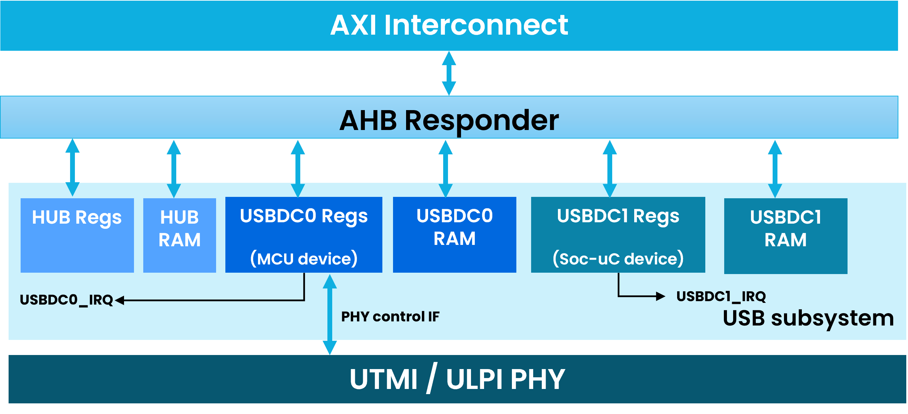
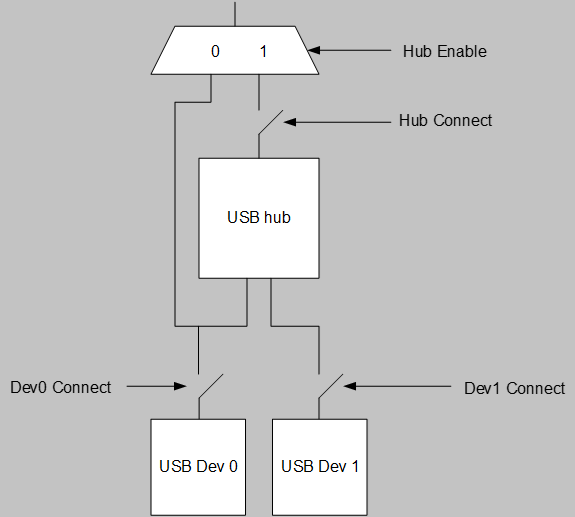
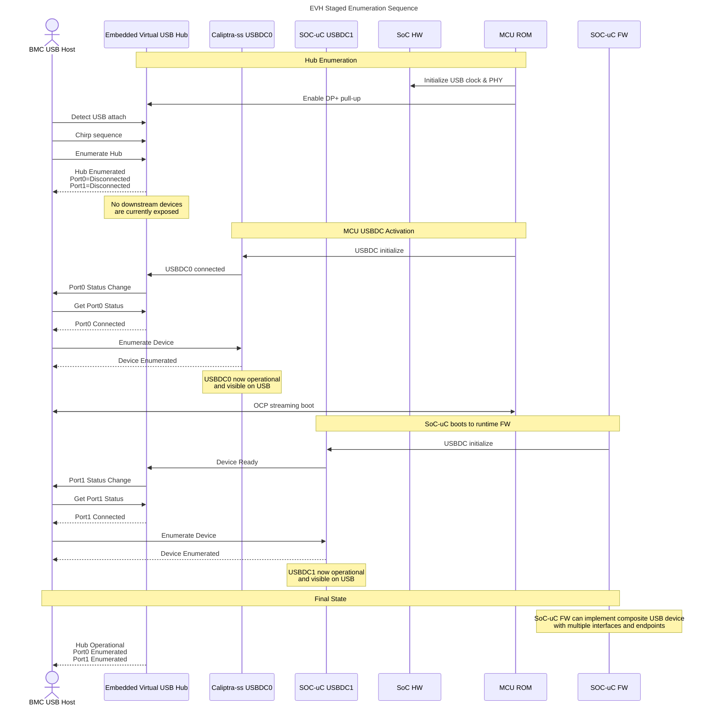
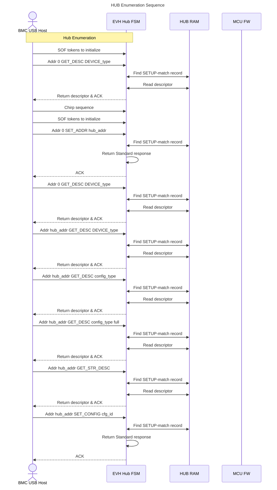
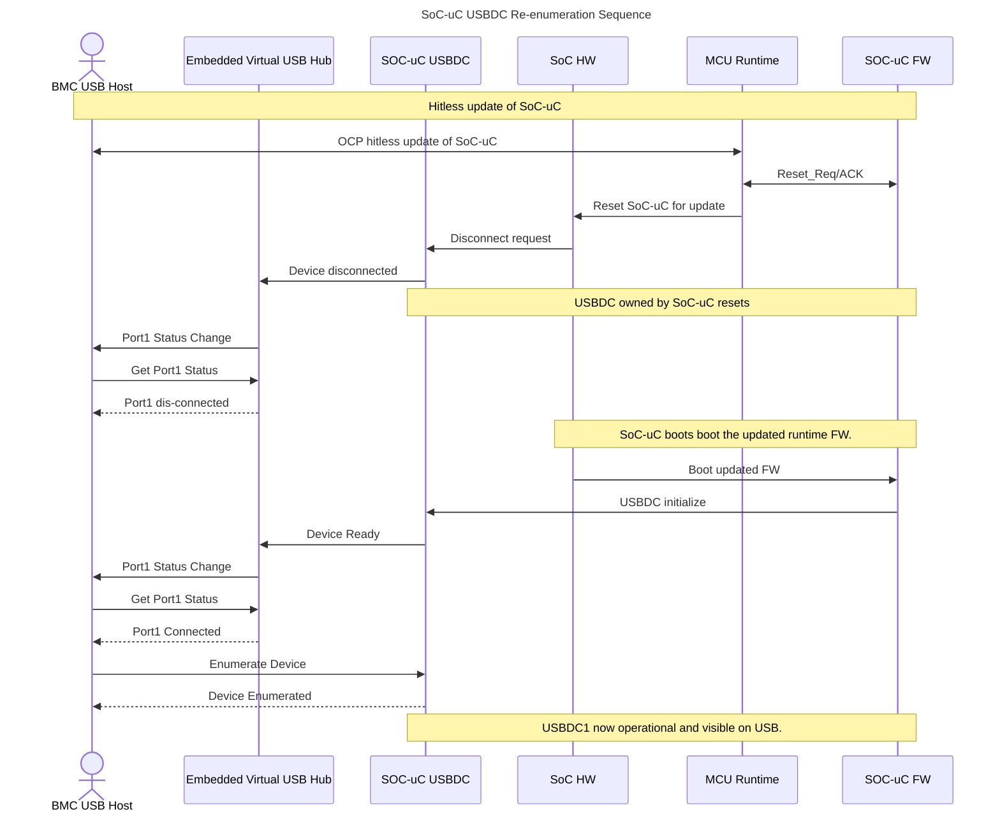

# USB 2.0 Compound Device Programmers Guide

**Status:** Draft for review  
**Target repository:** USB2 repository  
**Applies to:** Janus / Caliptra Subsystem USB compound device  
**Intended consumers:** MCU ROM, MCU runtime firmware, SoC firmware, SoC integration, and verification teams

> Register and memory base addresses are integration-defined unless an offset is explicitly stated. Firmware must use the final generated register definitions and linker/memory-map definitions.

## 1. Scope

This document defines the software programming requirements for a USB 2.0 compound device containing:

- one embedded USB 2.0 hub controller;
- Device 0, a USB device-controller instance owned by the Caliptra Subsystem MCU;
- Device 1, a USB device-controller instance owned by the SoC controller;
- one hub register interface and one dedicated HUB RAM;
- two independent device-controller register interfaces; and
- two dedicated endpoint-control-list RAM regions and associated data-buffer regions, one for each device controller.

The requirements cover cold boot, hub and device enumeration, endpoint-list initialization, controlled disconnect and reconnect, SoC reset, hitless firmware update, USB bus reset, and recovery.

### 1.1 Document Version


| Date            |   Document Version | Description       |
|-----------------|--------------------|-------------------|
| Aug 4th, 2026   |   v0p1             | Work in progress  |


### 1.2. Normative Language

The terms **MUST**, **MUST NOT**, **SHALL**, **SHOULD**, **SHOULD NOT**, and **MAY** are normative.

### 1.3. Terminology

| Term | Definition |
|---|---|
| Upstream host | The external BMC or platform host controlling the USB bus. |
| Hub | The integrated USB 2.0 hub presented to the upstream host. |
| MCU device | The USB device-controller instance owned by the Caliptra Subsystem MCU. |
| SoC device | The USB device-controller instance owned by the non-Caliptra SoC controller. |
| Function reset | Reset of USB device-controller state without necessarily resetting the hub. |
| Controller reset | Reset of the processor or controller that owns a USB device instance. |
| Disconnect | Removal of a downstream device from the host-visible USB topology. |
| Reconnect | Reattachment of a downstream device, followed by host-driven enumeration. |
| DCON | Logical device-connect control. The final register and bit name is TBD. |
| ROM | Caliptra Subsystem MCU boot ROM unless otherwise stated. |

## 2. Architecture 

### 2.1 System View

The SoC with caliptra-ss containing USB module exposes one physical USB connection to the BMC host through a single USB PHY. Behind this physical connection, the device enumerates as a USB compound device containing:

1. Embedded Virtual USB Hub with two downstream ports.
2. Downstream Port 0 connected to USBDC0 managed by MCU.
3. Downstream Port 1 connected to USBDC1 managed by SoC-uC.

The external BMC host observes a topology equivalent to:


```text
                        BMC USB Host
                            |
                            |
                  Single USB Connection
                            |
                            v
                   +----------------------+
                   | Embedded Virtual Hub |
                   |       (EVH)          |
                   +----------------------+
                        |             |
                        |             |
                        v             v
                  +-----------+   +-------------+
                  |   USBDC0  |   |   USBDC1    |
                  | MCU Device|   |SoC-uC Device|
                  +-----------+   +-------------+
```
### 2.2 Programmer View



#### 2.2.1. Software-visible resources

| Resource | Function | Primary owner |
|---|---|---|
| Hub control registers | Selects hub bypass/enable mode and controls upstream hub connection | MCU ROM / MCU firmware |
| HUB RAM | Stores hub descriptors, SETUP-request match entries, and response metadata | MCU ROM / MCU firmware |
| Device 0 register bank | Controls MCU-owned USB device instance, including DCON | MCU ROM / MCU firmware |
| Device 0 EP-list RAM | Stores USBDC0 endpoint command/status entries | MCU ROM / MCU firmware |
| Device 0 data-buffer RAM | Stores USBDC0 SETUP, control, interrupt, and bulk-transfer data | MCU ROM / MCU firmware |
| Device 0 IRQ | IRQ associated with USBDC0 instance. | MCU ROM / MCU firmware |
| Device 1 register bank | Controls SoC-owned USBDC1 instance, including DCON | SoC-uC firmware |
| Device 1 EP-list RAM | Stores USBDC1 endpoint command/status entries | SoC-uC firmware |
| Device 1 data-buffer RAM | Stores USBDC1 SETUP, control, interrupt, and bulk-transfer data | SoC-uC firmware |
| Device 1 IRQ | IRQ associated with USBDC1 instance. | SoC-uC firmware |

The SoC integration MUST prevent unintended cross-access between the MCU-owned and SoC-owned device-controller resources. The integration MUST also provide an authorized path for the MCU or reset-control logic to force Device 1 to disconnect while the SoC controller is unavailable.

### 2.3 Operating modes

The USB module ooperate in two modes.
- **Single device mode**: When `HUB_EN = 0`, the hub is bypassed and USBDC0 connects directly to the upstream USB interface.
- **Embedded Virtual HUB mode**: When `HUB_EN = 1`, the embedded hub is present in the USB tree and USBDC0 and USBDC1 appear as its two embedded downstream devices.
    - USBDC0 and USBDC1 connection states are independently controlled by the `DCON` field in the corresponding device-controller register bank.

*Figure: USB Subsystem Block Diagram*



### 2.4 Activity Flow Diagrams
#### 2.4.1 Compound Device Enumeration Sequence

The compound device shall enumerate in the following conceptual order:

1. USB PHY and clocks are initialized.
2. EVH presents device attach to the USB host.
3. Host enumerates the EVH as a virtual hub.
4. EVH reports downstream Port 0 connection.
5. Host enumerates Port 0 device through USBDC0.
6. EVH reports downstream Port 1 connection.
7. Host enumerates Port 1 device through USBDC1.
8. EVH enters all-ports-enumerated state.

The highlighted notes define the compound device as enumerating as an embedded virtual hub with two ports, where Port 0 is connected to one USBDC instance and Port 1 is connected to a second USBDC instance.


--------------------
##### 2.4.1.1 HUB Enumeration



#### 2.4.2 SoC-uC Reset and Re-enumeration
This use case describes the behavior when the SoC-uC subsystem experiences an independent reset due to hitless update or system recovery scenario.

The SoC-uC owned USBDC1 becomes temporarily unavailable. The Embedded Virtual USB Hub (EVH) shall report the corresponding downstream port disconnect to the BMC USB Host. Once the SoC-uC subsystem reboots and reinitializes USBDC1, the EVH shall report a new Port1 connection event, causing the host to perform device re-enumeration.
The Caliptra MCU device attached to Port0 remains operational throughout this sequence.

This mechanism provides:

* Isolation between MCU and SoC-uC USB functions.
* Independent recovery of the SoC-uC subsystem.
* Standard USB hub behavior visible to the host.
* Host-driven re-enumeration after subsystem recovery.
* No reset or disruption of the EVH or Port0 device.


##### 2.4.2.1 SoC USB reset asserted with SoC reset

If the USBDC1 AHB reset is asserted with the SoC controller reset:

1. USBDC1 register state is reset and USBDC1 disconnects.
2. Hub and USBDC0 MUST remain operational.
3. After restart, SoC firmware MUST rebuild USBDC1's register state, EP list, and buffers before setting USBDC1 `DCON`.

##### 2.4.2.2 SoC USB reset not asserted

If USBDC1 is not reset automatically:

1. The reset initiator or MCU firmware MUST clear USBDC1 `DCON` before SoC reset.
2. Firmware MUST quiesce active USBDC1 endpoint buffers and revoke USBDC1 RAM ownership as required.
3. USBDC1 MUST remain disconnected while the SoC owner is unavailable.
4. Restarted SoC firmware MUST reinitialize USBDC1 before setting `DCON`.
5. Firmware MUST NOT clear `HUB_CONNECT`, because that would also disconnect USBDC0.

Returning STALL responses for the entire reset interval is not the required recovery model. Controlled USBDC1 disconnect and reconnect is required.

#### 2.4.3 Common Cold-Boot Sequence

```text
Keep HUB_CONNECT, USBDC0.DCON, and USBDC1.DCON cleared
    -> enable clocks and release resets in integration-defined order
    -> initialize and validate HUB RAM
    -> set HUB_EN
    -> initialize USBDC0 registers, EP list, and buffers
    -> initialize USBDC1 only if its owner and memory are ready
    -> set HUB_CONNECT after VBUS is valid
    -> set USBDC0.DCON
    -> set USBDC1.DCON only when SoC firmware is ready
    -> allow host enumeration
```

## 3. Hub Control 
### 3.1 HUB Registers

The hub has a dedicated AHB slave interface containing one 32-bit control & status register at offset `0x000`.
| Offset | Register Name | Access | Description |
|--------|---------------|--------|-------------|
| 0x00 | HUB Control Register | RW | Contains bitfields which control HUB behavior. |
| 0x04 | HUB status Register | RO | Contains status flags of HUB state. |

#### 3.1.1 HUB Control register bitfields
| Bit | Field | Access | Reset | Description |
|---:|---|---|---|---|
| 7 | `HUB_EN` | RW | 0 | `0`: hub disabled and bypassed; Device 0 interfaces directly to the upstream UTMI path. `1`: hub enabled in the USB tree. |
| 16 | `HUB_CONNECT` | RW | 0 | `0`: disconnect the hub; when `HUB_EN = 1`, both embedded devices are also disconnected from the host-visible topology. `1`: connect the hub when VBUS is detected. |
| Other | Reserved | RO | 0 | Reads as zero. Firmware MUST preserve reserved bits as zero. |

#### 3.1.1 HUB status register bitfields <TBD>
| Bit | Field | Access | Reset | Description |
|---:|---|---|---|---|
| 31 - 0 | Reserved | RO | 0 | Reads as zero. Firmware MUST preserve reserved bits as zero. |

#### 3.1.2 Hub register programming rules

1. Firmware MUST clear `HUB_CONNECT` before changing `HUB_EN`.
2. Firmware MUST program and validate the complete HUB RAM image before setting `HUB_EN`.
3. Firmware MUST NOT modify HUB RAM while `HUB_EN = 1`.
4. In hub mode, firmware MUST set `HUB_CONNECT` only after the hub register state and HUB RAM contents are valid.
5. Firmware MUST configure each device-controller instance and its EP-list RAM before setting that instance's `DCON` bit.
6. Clearing `HUB_CONNECT` disconnects the complete compound device. It MUST NOT be used for a Device 1-only reset or hitless update when Device 0 must remain available.

### 3.2 HUB RAM Programming Model

#### 3.2.1 Capacity and access window

The dedicated HUB RAM is 512 bytes and is mapped at hub RAM byte offsets `0x200` through `0x3FF`.

Firmware MUST observe the following rules:

1. HUB RAM MUST be programmed before `HUB_EN` is set to `1`.
2. HUB RAM MUST be treated as immutable while `HUB_EN = 1`; modifying it in that state has undefined behavior.
3. The complete RAM image SHOULD be built in ordinary memory, validated, and then copied into HUB RAM while the hub is disabled.
4. Firmware SHOULD read back the programmed words before enabling the hub.
5. The hub controller supports descriptors with a maximum length of 64 bytes.
6. The first descriptor stored in HUB RAM is limited to 60 bytes. Storing the hub Device Descriptor first is recommended.
7. The number of descriptors and request-match entries is configurable within the available 512-byte RAM.

> The offsets in the remainder of this section are HUB RAM-local offsets. If software accesses the RAM through the hub address window, it must add the HUB RAM aperture base offset of `0x200`.

#### 3.2.2 Logical organization

HUB RAM contains three logical regions:

1. **Descriptor/response data region**: This region is divided in to 64 byte records. Each record can contain a descriptor or response data byte sequences returned during control-read transfers.
    - Last four bytes of the first descriptor record shall be set to addres offset of the first SETUP-match entry.
2. **SETUP-match region**: This region is divided in to 16 byte entries. HUB FSM uses these fixed-format entries to match requests and select a response or internal hub operation.

Below table shows the recommended HUB_RAM layout:
| Byte Offset  | Length in bytes | Fieldname    | Description                                            |
|---------|--------|--------------|--------------------------------------------------------|
| 0x0000  | 60     | `Descriptor0`  | Contains first descriptor padded to 60 bytes. Recommended to place **Device descriptor** of the HUB. |
| 0x003C  |  4     | `ptrSetupTable`| Pointer to the first SETUP-match entry. |
| 0x0040  | 64     | `Descriptor1`  | Contains second descriptor padded to 64 bytes. Recommended to place **Configuration descriptor** containing *interface* and *endpoint* descriptors. |
| 0x0080  | 64     | `Descriptor2`  | Contains second descriptor padded to 64 bytes. Recommended to place **HUB class descriptor**.|
| 0x00C0  | 64     | `Descriptor3`  | Contains second descriptor padded to 64 bytes. Recommended to place **Device Qualifier descriptor**.|
| 0x0100  | 64     | `Descriptor4`  | Contains second descriptor padded to 64 bytes. Recommended to place **Other Speed Configuration descriptor**.|
| 0x0140  | 16     | SETUP-match 0| Contains first SETUP-match record. |
| 0x0150  | 16     | SETUP-match 1| Contains SETUP-match record. |
| 0x0160  | 16     | SETUP-match 2| Contains SETUP-match record. |
| 0x0170  | 16     | SETUP-match 3| Contains SETUP-match record. |
| 0x0180  | 16     | SETUP-match 4| Contains SETUP-match record. |
| 0x0190  | 16     | SETUP-match 5| Contains SETUP-match record. |
| 0x01A0  | 16     | SETUP-match 6| Contains SETUP-match record. |
| 0x01B0  | 16     | SETUP-match 7| Contains SETUP-match record. |
| 0x01C0  | 16     | SETUP-match 8| Contains SETUP-match record. |
| 0x01D0  | 16     | SETUP-match 9| Contains SETUP-match record. |
| 0x01E0  | 16     | SETUP-match 10| Contains SETUP-match record. |
| 0x01F0  | 16     | SETUP-match 11| Contains SETUP-match record. |


#### 3.2.3 Descriptor region 

1. Descriptor and fixed response data MUST be stored before their associated request-match entries are activated. 
    - The design supports HUB descriptors with a maximum length of 64 bytes. The maximum size of the first descriptor stored in the USB HUB RAM is limited to be 60 bytes. 
    - It is recommended (but not required) that the descriptor stored in the first location is the DeviceDescriptor of the hub.
    - The number of descriptors and requests that can be stored in the USB HUB RAM is configurable.

2. HUB RAM local offset `0x003C` MUST contain an address pointer to the first location immediately after all descriptor data.
3. At the pointed-to location, firmware MUST store the link to the first SETUP-match entry.
4. Every descriptor selected by a SETUP-match entry MUST fit completely within HUB RAM.
5. Firmware MUST ensure that descriptor-response lengths do not exceed the stored object or the 64-byte descriptor limit.

#### 3.2.4 SETUP-match region

When endpoint zero receives a SETUP packet, the hub FSM searches the programmed match entries in order. An entry matches only when all of the following are true:

```text
received.bmRequestType == entry.bmRequestType
received.bRequest      == entry.bRequest
(received.wValue & entry.wValue_mask) == entry.wValue
(received.wIndex & entry.wIndex_mask) == entry.wIndex
```

If an entry does not match, the FSM advances to the next entry. The final entry in the table MUST set `L = 1` to terminate the search.

Firmware MUST:

- provide an explicit final entry with `L = 1`;
- prevent the search chain from pointing outside HUB RAM;
- ensure masks do not accidentally match unsupported requests; and
- order more-specific entries before broader masked entries when overlap is possible.

#### 3.2.5 SETUP-match entry fields

Each request-match entry contains 16 bytes:

| Byte Offset  | Length in bits | Field | Description |
|--------------|----------------|-------|-------------------------|
| 0x00  | 8  | `bmRequestType` | Exact value to compare against the received SETUP packet. |
| 0x01  | 8  | `bRequest` | Exact value to compare against the received SETUP packet. |
| 0x02  | 16 | `wValue` | Expected masked value. |
| 0x04  | 8  | `Request` | <table><tr><th>Bits</th><th>Field</th><th>Description</th></tr><tr><td>6:0</td><td>`Request`</td><td>Encoded operation performed by the hub FSM.</td></tr><tr><td>7</td><td>`L`</td><td>Set on the final match entry.</td></tr></table> |
| 0x05  | 8  | `DataPhase_Buffer` | Selects descriptor data, standard-request handling, or hub-class handling. |
| 0x06  | 16  | `wValue_mask` | Mask applied to received `wValue`. |
| 0x08  | 16  | `wIndex` | Expected masked value. |
| 0x0A  | 16  | `DataPhase_Length` | Number of bytes returned during the control-transfer data phase. |
| 0x0C  | 16  | `wIndex_mask` | Mask applied to received `wIndex`. |
| 0x0E  | 16  | `Reserved` | Reserved. |

##### 3.2.5.1 Request field encodings

| `bRequest` | Encoding | Required hub behavior |
|---|---:|---|
| GetDescriptor / descriptor-only response | `0x00` | Return programmed response data; no additional state action. |
| SetAddress | `0x01` | Update the hub address after successful request completion. |
| SetConfiguration | `0x02` | Set hub configuration to `0` or `1`. |
| SetDeviceFeature | `0x03` | Set supported hub-device feature, including Remote Wake or PHY Test Mode as applicable. |
| SetEndpointFeature | `0x04` | Halt the selected hub endpoint. |
| GetConfiguration | `0x05` | Return the active configuration value. |
| GetInterface | `0x06` | Return interface value `0`; the hub implements one interface. |
| GetDeviceStatus | `0x07` | Return Remote Wake and Self-Powered status. |
| GetInterfaceStatus | `0x08` | Return `0x00`. |
| GetEndpointStatus | `0x09` | Return hub endpoint-halt status. |
| ClearDeviceFeature | `0x0A` | Clear Remote Wake. |
| ClearEndpointFeature | `0x0B` | Clear endpoint halt. |
| ClearPortFeature, class | `0x80` | Update downstream-port status for a class request. |
| SetFeature, class | `0x81` | Update hub or downstream-port state for a class request. |
| GetStatus, class | `0x82` | Return hub or downstream-port status. |

Firmware MUST program only operations supported by the implemented hub FSM and the advertised hub descriptors.

##### 3.2.5.2 DataPhase_Buffer encoding

`DataPhase_Buffer` selects the block that services the matched request. There are 3 servicers:

|Servicer | Encoding | Meaning |
|---------|----------|---------|
| HUB_RAM descriptor region | Bit 7 = `1` | Return descriptor/response data. |
|                           | Bits `[6:0]`| Select the descriptor data buffer: <br>`0` selects `Descriptor0`,<br>`2` selects `Descriptor2`, and so on. |
| HUB_FSM Standard resp buffer| Bits `[7:6]` = `00` | Execute a standard hub request. |
|                             | Bits `[5:0]` | MUST be zero because only one hub instance is supported. |
| HUB_FSM Class resp buffer| Bits `[7:6]` = `01` | Execute a hub-class-specific request. |

`DataPhase_Length` MUST contain the number of bytes returned in the data phase. For no-data requests it MUST be zero.

#### 3.2.6 Required hub descriptors

The HUB RAM image for the two-port compound device SHOULD provide the descriptors required by the selected operating speed and advertised capability, including:

- Device Descriptor;
- Configuration Descriptor, including the hub interface and interrupt IN endpoint;
- Hub Descriptor identifying two embedded downstream ports;
- Device Qualifier Descriptor, when applicable; and
- Other-Speed Configuration Descriptor, when applicable.

The Hub Descriptor MUST remain consistent with the hardware topology. In particular, it must advertise two downstream ports and mark the embedded devices as non-removable when that is the implemented configuration.

#### 3.2.7 HUB RAM construction and enable sequence

Firmware SHALL use the following sequence:

```text
1. Clear HUB_CONNECT.
2. Clear HUB_EN.
3. Build the descriptor and fixed-response byte arrays.
4. Place descriptor data in HUB RAM within size and boundary limits.
5. Program HUB RAM[0x003C] with the pointer to the location after descriptor data.
6. At that location, program the link to the first SETUP-match entry.
7. Program all SETUP-match entries, masks, operation codes, response selectors, and lengths.
8. Set L = 1 in the final entry.
9. Validate that all pointers, selected buffers, lengths, and entries are within the 512-byte RAM.
10. Read back and compare the HUB RAM image.
11. Set HUB_EN = 1.
12. Set HUB_CONNECT = 1 after VBUS and the remaining integration prerequisites are valid.
```

If validation or readback fails, firmware MUST leave `HUB_EN = 0` and `HUB_CONNECT = 0` and report a boot error.

#### 3.2.8 Updating HUB RAM after enable

To update descriptors or request patterns after the hub has been enabled, firmware MUST:

```text
1. Disconnect Device 0 and Device 1, or otherwise quiesce them as required by system policy.
2. Clear HUB_CONNECT.
3. Clear HUB_EN.
4. Confirm that the hub is inactive.
5. Program and validate the replacement HUB RAM image.
6. Set HUB_EN.
7. Set HUB_CONNECT.
8. Reconnect each ready downstream device by setting its DCON bit.
```

This operation causes host-visible disconnection and re-enumeration of the hub topology and SHOULD therefore be restricted to boot, explicit recovery, or controlled update flows.

## 4. USBDC Device Controller Programming Model

USBDC0 and USBDC1 each expose an independent device register bank and dedicated shared memory containing the endpoint command/status list and endpoint data buffers.

### 4.1 USBDC Registers Overview

This section gives an overview of the register set used to control the hardware functionalities of the USB Device Controller. All register addresses listed below are offsets. The base address of this IP block is system-dependent and must be defined by the integrator.

| Offset | Register Name | Access | Description |
|--------|---------------|--------|-------------|
| 0x00 | USB Device Command/Status Register | RW(C) | Contains all fields used to control USB device behavior. |
| 0x04 | USB Info Register | RO | Contains the frame number of the last received SOF, Chip ID, and error code. |
| 0x08 | USB Endpoint List Start Address | RW | Contains the start address of the Endpoint List stored in memory. |
| 0x0C | USB Data Buffer Start Address | RW | Contains the start address of the endpoint data buffers in memory. |
| 0x10 | LPM | RW | Contains fields for Link Power Management support. |
| 0x14 | USB EP Skip | RW | Used to indicate to hardware that the corresponding endpoint must be deactivated (Active bit cleared). |
| 0x18 | USB EP Buffer In Use | RW | Used for double buffering. Indicates which buffer is currently in use for each endpoint. |
| 0x1C | USB EP Buffer Config | RW | Indicates whether each endpoint uses single buffering or double buffering. |
| 0x20 | USB Interrupt Status Register | RWC | Contains interrupt status bits for the various USB interrupts. |
| 0x24 | USB Interrupt Enable Register | RW | Contains interrupt enable bits. If enabled and the corresponding interrupt status bit is set, a hardware interrupt is generated. |
| 0x28 | USB Set Interrupt Status Register | RW | Writing a 1 sets the corresponding interrupt status bit. Reading returns the same value as the USB Interrupt Status Register. |
| 0x2C | USB Interrupt Routing Register | RW | Selects whether each interrupt is routed to IRQ or FIQ. |
| 0x30 | USB Configuration | RO | Contains configuration values defined in Section 5. |
| 0x34 | USB EP Toggle | RO | Debug register indicating the current data toggle value for each endpoint. |
| 0x38 | Reserved | RO | Reserved. |
| 0x3C | UTMI+/ULPI Debug | RW | Allows reading and writing registers in the attached USB PHY. |

### 4.1 Per-device initialization

For each device instance, the owning firmware MUST:

1. Clear `DCON` and keep the device disconnected.
2. Mask interrupts and clear pending status.
3. Program the Endpoint Command/Status List Start register to the instance's dedicated EP-list RAM.
4. Initialize endpoint-zero OUT, SETUP storage, and endpoint-zero IN entries.
5. Initialize all generic endpoint entries and their data-buffer address offsets.
6. Set unused endpoints to Disabled.
7. Initialize buffer ownership, byte counts, active state, stall state, and toggle state.
8. Enable the required interrupts.
9. Set `DCON` only after the complete register, EP-list, and buffer state is valid.

### 4.2 Endpoint command/status list

The endpoint list contains fixed-order entries beginning with EP0 OUT, SETUP storage, and EP0 IN, followed by OUT and IN entries for generic endpoints. Generic endpoints may use single or double buffering according to the IP configuration.

Firmware MUST obey the endpoint-entry ownership rules:

- It may set `Active` to `1`; hardware clears it when the buffer completes, a short packet is received, `NBytes` reaches zero, or a skip operation completes.
- Firmware MUST NOT modify a command/status word while its `Active` bit is `1`.
- Firmware may modify `Disabled` or `Stall` only while `Active = 0`.
- To deactivate an active buffer, firmware MUST use the corresponding endpoint-skip control rather than directly clearing `Active`.
- Buffer address and `NBytes` fields MUST remain within the device instance's assigned RAM region.

The Endpoint Command/Status List start register points to the start of the list containing all endpoint information in memory. Endpoint ordering is fixed.

#### 4.2.1 Endpoint List Layout

| Offset | Endpoint Entry |
|-----:|----------------|
| 0x00 | EP0 OUT Buffer descriptor.|
| 0x04 | SETUP Buffer descriptor. |
| 0x08 | EP0 IN Buffer descriptor |
| 0x0C | RESERVED |
| 0x10 | EP1 OUT Buffer 0 - Generic Buffer descriptor |
| 0x14 | EP1 OUT Buffer 1 - Generic Buffer descriptor |
| 0x18 | EP1 IN Buffer 0 - Generic Buffer descriptor |
| 0x1C | EP1 IN Buffer 1 - Generic Buffer descriptor |
| 0x20 | EP2 OUT Buffer 0 - Generic Buffer descriptor |
| 0x24 | EP2 OUT Buffer 1 - Generic Buffer descriptor |
| 0x28 | EP2 IN Buffer 0 - Generic Buffer descriptor |
| 0x2C | EP2 IN Buffer 1 - Generic Buffer descriptor |
| ... | Repeated for EP3 through EP13 |
| 0xE0 | EP14 OUT Buffer 0 - Generic Buffer descriptor  |
| 0xE4 | EP14 OUT Buffer 1 - Generic Buffer descriptor  |
| 0xE8 | EP14 IN Buffer 0 - Generic Buffer descriptor  |
| 0xEC | EP14 IN Buffer 1 - Generic Buffer descriptor  |
| 0xF0 | EP15 OUT Buffer 0 - Generic Buffer descriptor  |
| 0xF4 | EP15 OUT Buffer 1 - Generic Buffer descriptor  |
| 0xF8 | EP15 IN Buffer 0 - Generic Buffer descriptor  |
| 0xFC | EP15 IN Buffer 1 - Generic Buffer descriptor  |

#### 4.2.2 EP0 Buffer Descriptors

EP0 OUT Buffer Descriptor
| Bits | Field | Description      |
|------|-------|------------------|
|10:0 | addr_offset | EP0 OUT Buffer Address Offset.|
|25:11| length |EP0 OUT Buffer NBytes.|
|26   | R | Reserved |
|27   | TV | Toggle value. For the control endpoint 0 this bit is used as the toggle value. When the toggle reset bit is set, the data toggle is updated with the value programmed in this bit. |
|28   | TR | Toggle reset When software sets this bit to one, the HW will set the toggle value equal to the value indicated in the ¿toggle value¿ (TV) bit. For the control endpoint 0, this is not needed to be used because |
|29   | S | Stall. <br>0: The selected endpoint is not stalled. <br>1: The selected endpoint is stalled.<br>The active bit has always higher priority than the Stall bit. This means that a Stall handshake is only sent when the active bit is 0 and the stall bit is one. Software can only modify this bit when the active bit is 0. |
|30   | R | Reserved |
|31   | A | Active. The buffer is enabled. HW can use the buffer to store received OUT data or to transmit data on the IN endpoint. Software can only set this bit to 1. As long as this bit is set to one, software is not allowed to update any of the values in this 32-bit word. In case software wants to deactivate the buffer, it must write a one to the corresponding ¿skip¿ bit in the USB endpoint skip register. Hardware can only write this bit to 0. It will do this when it receives a short packet or when the NBytes field transitions to 0 or when software has written a one to the ¿skip¿ bit. If hardware receives a token for an endpoint that is not active, it will return the following handshake or data: <br>- Non-isochronous endpoint: NAK handshake is sent. <br>- Isochronous IN endpoint: empty data packet is sent. <br>- Isochronous OUT endpoint: received data is ignored and no handshake is sent. |

EP0 IN Buffer Descriptor
| Bits | Field | Description      |
|------|-------|------------------|
|10:0 | addr_offset | EP0 IN Buffer Address Offset.|
|25:11| length |EP0 IN Buffer NBytes.|
|26   | R | Reserved |
|27   | TV | Toggle value. Check above table.|
|28   | TR | Toggle reset. Check above table.|
|29   | S | Stall. Check above table.|
|30   | R | Reserved |
|31   | A | Active. Check above table.|

EP0 SETUP Buffer Descriptor
| Bits | Field | Description      |
|------|-------|------------------|
|10:0 | addr_offset | SETUP bytes Buffer Address Offset.|
|31:11| R | Reserved. |

> When receiving a SETUP token for endpoint zero, hardware uses only the SETUP Bytes Buffer Address Offset. A compliant SETUP stage contains 8 bytes.

#### 4.2.3 Generic EP Buffer descriptor

| Bits | Field | Description      |
|------|-------|------------------|
|10:0 | addr_offset | IN/OUT Buffer Address Offset. Bits 16 through 6 of the buffer start address. Hardware updates the offset after successful packet reception or transmission.|
|25:11| length | IN/OUT Buffer NBytes. For OUT endpoints, the maximum bytes that can be received. For IN endpoints, the bytes to transmit. Hardware decrements the value after each successful packet.|
|26   | T | **Endpoint Type.** <br>`0`: generic endpoint. <br>`1`: periodic endpoint. |
|27   | RF / TV | **Rate Feedback Mode / Toggle Value.** For non-control endpoints, it works with `T` to select endpoint behavior.|
|28   | TR | **Toggle Reset.** When firmware sets this bit, hardware updates the toggle to the value in `TV`.|
|29   | S | **Stall.** <br>`0`: endpoint not stalled. <br>`1`: endpoint stalled. Active has priority over Stall, so STALL is sent only when `A = 0`.|
|30   | D | **Disabled.** <br>`0`: endpoint enabled. <br>`1`: endpoint disabled. Firmware can modify this bit only when `A = 0`. |
|31   | A | **Active.** Enables the buffer. Hardware can use it to receive OUT data or transmit IN data. Firmware sets it to `1`; hardware clears it when a short packet is received, `NBytes` reaches zero, or the corresponding endpoint skip bit is set.|

## 5. USB Bus Reset and SetConfiguration

On USB bus reset, each device owner MUST:

1. clear software state associated with the previous address and configuration;
2. set `Disabled = 1` for all generic endpoints;
3. reinitialize endpoint-zero state; and
4. leave generic endpoints disabled until the host selects a configuration.

When a non-zero SetConfiguration value is accepted, firmware MUST:

1. enable every endpoint used by that configuration;
2. reset its data toggle using the defined endpoint-halt-clear procedure; and
3. keep all unused endpoints disabled.

## 6. Interrupt and Error Handling

1. Hub and device interrupt status MUST be cleared using the access semantics defined by their register specifications.
2. All polling loops MUST have bounded timeouts.
3. A per-device error SHOULD be recovered by disconnecting and resetting only that device.
4. A hub or PHY failure MAY require `HUB_CONNECT = 0` and complete re-enumeration.
5. Firmware MUST leave the hub disconnected if HUB RAM validation fails.

## 7. Memory Safety and Security

1. Only authorized masters may write the hub register, HUB RAM, device register banks, EP lists, and data buffers.
2. HUB RAM MUST be immutable while `HUB_EN = 1`.
3. Device 0 and Device 1 EP lists and data buffers MUST occupy non-overlapping protected regions.
4. Firmware MUST validate all endpoint buffer addresses, offsets, lengths, and ownership before activation.
5. Reset or disconnect of a device MUST prevent further DMA or endpoint-engine access to memory whose ownership has been revoked.
6. Host-provided SETUP packets, lengths, indexes, and payloads are untrusted inputs.
7. Unsupported requests MUST be rejected without exposing uninitialized or stale RAM.

## 8. Verification Requirements

Verification SHALL include:

1. hub-bypass mode with USBDC0 directly connected;
2. hub mode with both embedded devices enumerated;
3. HUB RAM readback before enable;
4. attempted HUB RAM write while `HUB_EN = 1`;
5. exact and masked SETUP-match cases;
6. no-match traversal ending at `L = 1`;
7. malformed pointer, response-buffer, and length cases;
8. each supported Request encoding;
9. USBDC1 reset and reconnect while USBDC0 remains operational;
10. clearing `HUB_CONNECT` and re-enumerating the whole topology;
11. USB bus reset followed by endpoint disable and EP0 recovery;
12. SetConfiguration enabling only the selected endpoints; and
13. attempted cross-access between USBDC0 and USBDC1 RAM regions.

## 9. Open Items

| ID | Open item |
|---|---|
| USB2-PRG-001 | Confirm final SoC address map for the hub register, USBDC0 registers, USBDC1 registers, HUB RAM, and both EP-list/data-buffer RAM regions. |
| USB2-PRG-002 | Confirm the exact pointer width and units used by HUB RAM offset `0x000F` or `0x003C`and the SETUP-match link. |
| USB2-PRG-003 | Confirm the final binary layout and alignment of each SETUP-match entry. Add |
| USB2-PRG-004 | Confirm whether hardware blocks or ignores writes to HUB RAM while `HUB_EN = 1`; software must treat such writes as prohibited regardless. |
| USB2-PRG-005 | Confirm the final descriptor set, VID/PID, strings, power attributes, interrupt endpoint interval, and speed-dependent values. |
| USB2-PRG-006 | Confirm the mechanism available to MCU firmware or reset control to force Device 1 `DCON = 0` during unexpected SoC failure. |
| USB2-PRG-007 | Confirm USB 2.0 LPM L1 support and the associated hub/device descriptor and programming requirements. |

## 14. References

1. *Universal Serial Bus Specification, Revision 2.0*.
2. *USB 2.0 Link Power Management Addendum*, if LPM L1 is implemented.
3. *NXP USB2.0 HS/FS/LS USB Device and Host IP Integration Guide*.
4. Caliptra Subsystem Hardware Specification.
5. Caliptra Subsystem Integration Specification.

